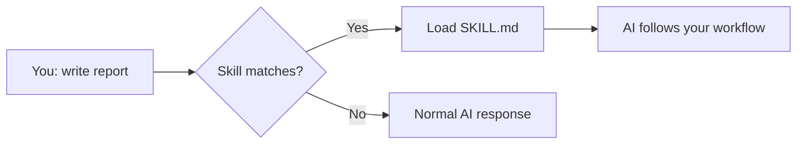

# How to Write Claude Skills — Custom Instructions That Make AI Consistent

## What You'll Learn

- What Skills are and how they work
- How to write a SKILL.md file
- 3 practical skills you can create today
- How to share skills with your team

## What Are Skills

Skills are reusable instruction files that make AI follow your workflow every time. Instead of explaining the same thing in every conversation, you write it once as a Skill. AI loads it automatically when relevant.



A Skill is just a folder with a `SKILL.md` file:

```
my-skill/
└── SKILL.md
```

## SKILL.md Structure

```markdown
---
name: skill-name
description: What this skill does and when to use it. Include trigger phrases like "write a report", "summarize meeting notes", etc.
---

# Skill Name

Instructions for the AI go here. Be specific about:
1. What to do
2. What format to output
3. What to avoid
```

The **description** is critical — it determines when the skill loads. Include specific trigger phrases.

## Skill 1: Meeting Notes to Action Items

```markdown
---
name: meeting-action-items
description: Extracts action items from meeting notes. Use when you have meeting notes, 
transcript, or rough notes and want structured action items. Triggers on "meeting notes", 
"action items", "follow up email", "meeting summary".
---

# Meeting Notes → Action Items

Read the meeting notes provided by the user.

## Output format

### Summary
3-5 bullet points of what was discussed.

### Action Items
| # | Task | Owner | Deadline | Priority |
|---|------|-------|----------|----------|
| 1 | ... | ... | ... | High/Med/Low |

### Decisions Made
- [List decisions with who decided]

### Next Meeting
- Date/time if mentioned
- Agenda items if mentioned

## Rules
- Write in Thai
- If owner is unclear, mark as "TBD" and flag it
- If deadline is unclear, mark as "TBD" and flag it
- Sort action items by priority (High first)
```

## Skill 2: Email Drafter (Thai Professional)

```markdown
---
name: thai-email
description: Drafts professional Thai emails from rough notes. Use when you need to 
write a business email in Thai. Triggers on "write email", "draft email", "send email", 
"email to client", "professional email".
---

# Thai Professional Email Drafter

Turn the user's rough notes into a professional Thai email.

## Input
User provides: recipient role, purpose, key points, tone preference.

## Output format
Subject line (concise, action-oriented)

เรียน [คุณ/คุณนาย/ท่าน] [name if provided],

[Opening — context/purpose]

[Body — key points, each as its own paragraph]

[Closing — clear ask or next step]

ขอแสดงความนับถือ
[Signature placeholder]

## Rules
- Use professional Thai (ไม่ใช้คำภาษาพูด)
- Default tone: polite and direct
- If tone not specified, use "formal"
- Keep under 300 words
- Subject line must start with action word or topic
- Always end with a clear ask or deadline
```

## Skill 3: Weekly Report Generator

```markdown
---
name: weekly-report
description: Generates weekly status reports from bullet points. Use when you need to 
write a weekly report, status update, or progress report. Triggers on "weekly report", 
"status update", "progress report", "what I did this week".
---

# Weekly Report Generator

Turn rough bullet points into a structured weekly report.

## Output format

## Weekly Report: [Week number] ([Date range])

### Completed This Week
- [Task] — [Brief result]

### In Progress
- [Task] — [Status % or description] — ETA: [date]

### Blocked / Needs Help
- [Issue] — [What's blocking] — [Who can help]

### Next Week Plan
- [Planned task] — [Priority]

### Key Metrics
| Metric | This Week | Last Week | Change |
|--------|-----------|-----------|--------|

## Rules
- Write in Thai
- If data not provided, leave placeholder [รอข้อมูล]
- Keep each item to one line
- Be specific, not vague ("Fixed login bug on mobile" not "Did some bug fixes")
```

## How to Install Skills

### On Claude Desktop (claude.ai)

1. Go to **Customize** → **Skills**
2. Click **Create Skill**
3. Paste your SKILL.md content
4. Save — it's now available in all your conversations

### On Claude Code (CLI)

```bash
mkdir -p ~/.claude/skills/thai-email
# Create SKILL.md in that folder
```

Skills load automatically when your prompt matches the description.

## Sharing Skills with Your Team

1. In Claude Desktop, go to Customize → Skills
2. Open a skill you created
3. Click **Share**
4. Enter team member names or emails
5. They get the skill in their Claude automatically

## Skills vs Projects

| Feature | Skills | Projects |
|---------|--------|----------|
| What it stores | Instructions (how to do something) | Files + instructions (context for a project) |
| When it loads | When your prompt matches | When you open that project |
| Best for | Repeated workflows (emails, reports, reviews) | Long-running projects (client work, research) |
| Sharing | Share with individuals | Share with team |

## Key Takeaway

Skills turn your best workflows into repeatable AI behavior. If you find yourself explaining the same thing to AI multiple times — that should be a Skill. Write once, use forever.
