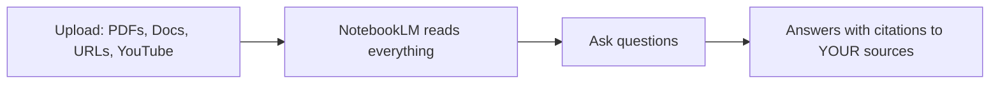

# Google NotebookLM — AI Tutor on YOUR Documents

## What You'll Learn

- What NotebookLM is and how it differs from chat AI
- How to upload documents and create an AI study guide
- Generating audio summaries (podcasts!) from your notes
- Practical use cases for work and learning

## What Is NotebookLM

NotebookLM is a free Google tool that becomes an AI expert on **your** documents. You upload PDFs, Google Docs, websites, YouTube videos — it reads everything and answers questions grounded in YOUR sources.

> **Diagram:** NotebookLM flow — upload PDFs/Docs/URLs/YouTube, NotebookLM reads everything, you ask questions, it answers with citations to your sources.



### NotebookLM vs Chat AI

| Feature | Chat AI (Claude/ChatGPT) | NotebookLM |
|---------|--------------------------|------------|
| Knowledge | General internet training | YOUR uploaded documents only |
| Hallucination risk | Medium-High | Low (grounded in your sources) |
| Citations | Sometimes fake | Real, clickable to source page |
| Audio summary | No | Yes (generates podcast-style audio) |
| Best for | General tasks, writing, coding | Studying, research, document analysis |

## Getting Started (Free)

1. Go to [notebooklm.google.com](https://notebooklm.google.com)
2. Sign in with Google account
3. Click **New Notebook**
4. Upload your sources (PDFs, Docs, URLs, YouTube links, paste text)
5. Start asking questions

No API key, no credit card, no install.

## Step 1: Upload Your Sources

Click **Add Source** and choose:

| Source Type | What You Can Upload |
|-------------|-------------------|
| PDF | Research papers, reports, textbooks, slide decks |
| Google Docs | Your own documents |
| Web URL | Blog posts, articles, documentation |
| YouTube URL | Video lectures, tutorials (auto-transcribed) |
| Paste Text | Meeting notes, rough notes, any text |
| Google Slides | Presentations |

Maximum: 50 sources per notebook, 500,000 words total.

## Step 2: Ask Questions Grounded in Your Sources

NotebookLM only answers from what you uploaded. If the answer isn't in your sources, it tells you.

### Useful Prompts

```
Summarize the key findings across all sources
```

```
What are the 3 main arguments in the uploaded paper? 
Include page references.
```

```
Create a study guide for [topic] based on these materials. 
Include key terms, definitions, and practice questions.
```

```
Compare what Source 1 says about [topic] vs what Source 2 says. 
Where do they agree? Where do they disagree?
```

```
I'm preparing for a meeting about [topic]. 
Based on these documents, what are the key talking points 
and potential questions I should be ready for?
```

## Step 3: Generate Audio Overview (Podcast)

NotebookLM can turn your documents into a **10-minute podcast-style audio discussion** between two AI hosts. This is genuinely useful for:

- Reviewing material while commuting
- Getting a different angle on complex documents
- Sharing summaries with people who prefer audio

How to use:
1. Open your notebook with sources loaded
2. Click **Notebook Guide** (top of the chat)
3. Click **Audio Overview** → **Generate**
4. Wait 2-5 minutes
5. Listen, download, or share the link

The AI hosts discuss your material naturally, with examples and explanations. Not a robotic TTS read — an actual conversation.

## Practical Workflows

### Workflow 1: Study for an Exam

```
1. Upload: textbook chapters (PDF), lecture slides, your notes (paste text)
2. Ask: "Create a study guide with key concepts and practice questions"
3. Ask: "What topics appear most frequently across all sources?"
4. Generate audio overview → listen while reviewing
```

### Workflow 2: Prepare for a Client Meeting

```
1. Upload: client's previous emails (paste), project proposal (PDF), 
   meeting notes from last session (Google Doc)
2. Ask: "What were the key concerns from the last meeting?"
3. Ask: "Based on the proposal, what questions is the client likely to ask?"
4. Ask: "Create a meeting prep brief with talking points"
```

### Workflow 3: Research Paper Analysis

```
1. Upload: 5-10 research papers (PDFs)
2. Ask: "Summarize the state of research on [topic] based on these papers"
3. Ask: "What methodology gaps exist across these studies?"
4. Ask: "Create a comparison table: Paper, Method, Key Finding, Limitations"
```

### Workflow 4: New Employee Onboarding

```
1. Upload: company handbook, product docs, FAQ, past team presentations
2. Ask: "What should a new team member know about [product/team]?"
3. Generate audio overview → share with new hires as intro material
```

## Notebook Tips

- **Organize by topic**: Create separate notebooks for separate projects
- **Save useful outputs**: Pin good responses as notes within the notebook
- **Iterate**: Ask follow-up questions to go deeper on specific points
- **Combine with other AI**: Use NotebookLM for grounded research, Claude for drafting and writing
- **Share notebooks**: Invite teammates to collaborate on the same sources

## Limitations

- Free tier has usage limits (generous for personal use)
- Audio overview is in English only (text Q&A works in Thai)
- Cannot edit uploaded documents — only read and analyze
- Sources must be under 500K words total per notebook
- No real-time collaboration like Google Docs

## Key Takeaway

NotebookLM is the best free tool for turning YOUR documents into an AI tutor. Upload once, ask anything, get grounded answers with real citations. And the audio podcast feature makes it unique — no other free tool does this. Use it when you need to understand your own materials deeply, not when you need general knowledge.
