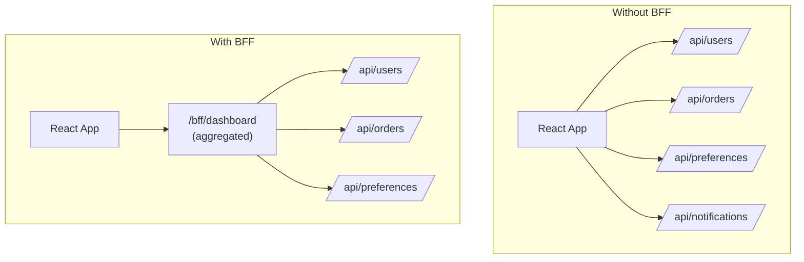

# Frontend Integration

## What

How a frontend application (React, Vue, React Native, mobile app) integrates with your backend API. This covers the patterns that make the backend-to-frontend connection work reliably.

## SPA Authentication Flow

### Token Storage

Where should the frontend store the JWT after login?

| Storage | XSS Risk | CSRF Risk | API Access |
|---|---|---|---|
| **localStorage** | High (JS can read it) | None | Manual (add to header) |
| **HttpOnly Cookie** | None (JS can't read) | High (auto-sent) | Automatic |
| **In-memory only** | None | None | Lost on refresh |

**Recommendation:** Use HttpOnly cookies for web apps. Use secure storage (Keychain/Keystore) for mobile apps.

### Refresh Token Rotation

Access tokens expire quickly (15 minutes). Refresh tokens live longer (7 days). The frontend uses the refresh token to get new access tokens without asking the user to log in again.

```text
1. Login → Server returns access_token (15min) + refresh_token (7d)
2. Use access_token for API calls
3. access_token expires → Frontend calls POST /auth/refresh with refresh_token
4. Server returns new access_token (+ optionally new refresh_token)
5. Repeat
```

**Rotation rule:** Issue a new refresh token on every refresh. If a stolen token is used, the legitimate user's next refresh fails (token replay detection).

### Token Revocation

Access tokens can't be revoked (they're stateless). To "log out" a user:
1. **Frontend** — Delete tokens from storage
2. **Backend** — Blacklist the refresh token so it can't be used to get new access tokens

For immediate revocation (banned user, security breach), use a token blacklist checked on every request (adds latency, requires shared state like Redis).

## BFF (Backend for Frontend)

A BFF is a thin backend layer between the frontend and your core APIs. It's tailored to one specific frontend (web, mobile, admin).



Benefits:
- **Fewer round-trips** — Mobile networks are slow. One call beats five.
- **Tailored responses** — The BFF returns exactly what the UI needs, nothing more
- **Security boundary** — The BFF handles auth, validation, and protocol translation

When to use: Mobile apps with many API calls, microservice backends where the frontend would need to call 5+ services, different UIs needing different data shapes.

## API Client Generation

Instead of hand-writing API client code, generate it from your OpenAPI spec.

```text
OpenAPI spec (openapi.json)
        ↓
    Generator (Kiota, OpenAPI Generator, Orval)
        ↓
Typed client code (TypeScript, Kotlin, Swift, etc.)
```

Benefits:
- **Type safety** — The client knows the request/response types. Compile-time errors, not runtime.
- **Always in sync** — When the API changes, regenerate the client. No "I forgot to update the frontend" bugs.
- **Less boilerplate** — No hand-writing `fetch` calls with URL construction and JSON parsing.

## Real-Time Options

When the frontend needs live updates (notifications, dashboards, chat), choose the right transport:

| Technology | Direction | Best For | Complexity |
|---|---|---|---|
| **WebSocket** | Bidirectional | Chat, games, real-time collaboration | Medium |
| **Server-Sent Events (SSE)** | Server → Client | Notifications, live feeds | Low |
| **Long Polling** | Server → Client | Legacy, simple cases | Low |
| **Webhooks** | Server → Server | Async callbacks between services | Low |

For most "push updates to the frontend" scenarios, start with SSE. It's simpler than WebSocket and sufficient for one-way notifications.

## Pagination and Frontend State

The frontend needs to handle paginated data. Use cursor-based pagination (not offset) for real-time feeds — offset pagination skips or duplicates items when new data arrives.

```text
# Offset pagination (problematic for real-time data):
GET /api/messages?offset=0&limit=20   → items 1-20
GET /api/messages?offset=20&limit=20  → items 21-40
# If 5 new messages arrive between calls, items shift. Duplicates or skips occur.

# Cursor pagination (stable):
GET /api/messages?limit=20            → items 1-20, cursor="abc123"
GET /api/messages?limit=20&after=abc123 → items 21-40, cursor="def456"
# New items don't affect pagination. Cursor is a stable position.
```

## Common Mistakes

- **Storing JWT in localStorage.** Any XSS attack steals the token. Use HttpOnly cookies for web, secure storage for mobile.
- **Not rotating refresh tokens.** A stolen refresh token works for its entire lifetime (7+ days). Rotate on every use.
- **Hand-writing API clients.** When the API changes, the client breaks silently. Generate from OpenAPI for type safety.
- **Using offset pagination for real-time feeds.** New items cause duplicates and gaps. Use cursor pagination.
- **One API call per component.** N components making N API calls on page load. Use a BFF or data-fetching library to batch requests.
