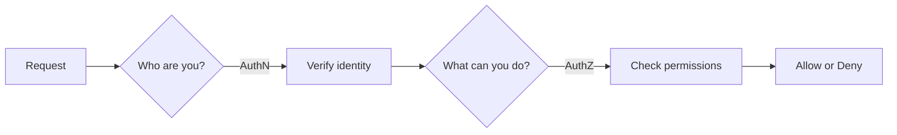

# Auth Concepts

## What

Authentication answers "who are you?" Authorization answers "what can you do?" They are different things. Confusing them causes security holes.

## Authentication vs Authorization



- **Authentication (AuthN)** — Prove your identity. Username + password, biometric, SSO login.
- **Authorization (AuthZ)** — Check permissions. Can this user access this resource? Admin? Read-only?

## Sessions vs Tokens

### Server-Side Sessions

1. User logs in with credentials
2. Server creates a session, stores it in memory or a database
3. Server sends back a session ID in a cookie
4. On each request, the server looks up the session

Pros: Server can revoke sessions instantly. Session data stays server-side.
Cons: Hard to scale across multiple servers (need shared session store). Stateful.

### Tokens (JWT)

1. User logs in with credentials
2. Server creates a signed token, sends it to the client
3. Client stores the token and sends it on each request
4. Server verifies the signature — no database lookup needed

Pros: Stateless. Easy to scale. Works across services.
Cons: Cannot revoke instantly (token is valid until expiry). Token contains data that can get stale.

## JWT Structure

A JWT has three parts separated by dots: `header.payload.signature`

```
xxxxx.yyyyy.zzzzz
```

**Header** — Algorithm and token type:
```json
{
  "alg": "HS256",
  "typ": "JWT"
}
```

**Payload** — Claims (data). Do not put secrets here:
```json
{
  "sub": "user-42",
  "name": "Alice",
  "role": "admin",
  "exp": 1700000000
}
```

**Signature** — Proves the token was not tampered with:
```
HMACSHA256(base64(header) + "." + base64(payload), secret_key)
```

## What JWT Is and Isn't

JWT **is**:
- A signed container for claims
- A way to verify data integrity (signature)
- Stateless authentication

JWT **is not**:
- Encrypted. Anyone can decode the payload with base64. Never put passwords or secrets in a JWT.
- A session replacement if you need instant revocation
- Secure by default. You must validate the signature, check expiry, verify the issuer.

## Key Decisions

| Need                     | Use                    |
|--------------------------|------------------------|
| Instant revocation       | Server-side sessions   |
| Scale across services    | JWT                    |
| Simple app, one server   | Sessions               |
| Microservices / API      | JWT                    |
| Both                     | JWT + refresh tokens with a revocation list |

## Common Mistakes

- Storing sensitive data in the JWT payload. It is base64-encoded, not encrypted.
- Not validating the JWT signature on every request.
- Using JWTs that never expire. Set a short expiry (15 min) and use refresh tokens.
- Accepting tokens from any issuer. Always verify `iss` (issuer) and `aud` (audience).
- Rolling your own crypto. Use established libraries.
