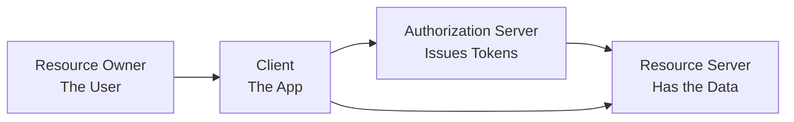

# OAuth 2.0 Basics

## What

OAuth 2.0 is an authorization framework. It lets a user grant a third-party application limited access to their resources without sharing their password.

## Why It Matters

You use OAuth every time you "Sign in with Google" or "Allow app to access your GitHub." It is the standard way to delegate access securely.

## Roles



- **Resource Owner** — The user who owns the data
- **Client** — The application requesting access
- **Authorization Server** — Issues tokens after authenticating the user
- **Resource Server** — The API holding the user's data

## Key Flows

### Authorization Code Flow (Most Common)

For server-side web applications. The most secure flow.

```
1. App redirects user to authorization server
   GET /authorize?response_type=code&client_id=APP_ID&redirect_uri=...

2. User logs in and grants permission

3. Authorization server redirects back with a code
   GET /callback?code=AUTH_CODE

4. App exchanges code for a token (server-to-server)
   POST /token { code, client_id, client_secret }

5. Authorization server returns access_token
```

The code exchange happens server-side so the client secret is never exposed to the browser.

Use when: Web apps with a backend. This is the default choice.

### Authorization Code Flow with PKCE

For mobile and single-page apps where you cannot keep a client secret safe.

Same as above, but:
- Before the redirect, the app generates a `code_verifier` (random string)
- It sends a `code_challenge` (hash of the verifier) in the authorization request
- When exchanging the code, it sends the original `code_verifier`
- The server verifies the verifier matches the challenge

Use when: Mobile apps, SPAs, any public client.

### Client Credentials Flow

For server-to-server communication. No user involved.

```
1. App sends its credentials to authorization server
   POST /token { client_id, client_secret, grant_type=client_credentials }

2. Authorization server returns access_token
```

Use when: One service calling another. Background jobs. No user context.

## Token Types

- **Access Token** — Short-lived (minutes to hours). Sent with every API request in the `Authorization` header: `Bearer <token>`
- **Refresh Token** — Long-lived (days to weeks). Used to get a new access token without asking the user to log in again. Stored securely, never sent to the resource server.

## Scopes

Scopes limit what a token can do. They are granted during authorization, not after.

```
scope=read:user write:repo
```

The token can read user info and write to repos, but nothing else.

## Common Mistakes

- Using the Implicit Flow. It was deprecated. Use Authorization Code with PKCE instead.
- Storing tokens in localStorage. They are accessible to XSS. Use HttpOnly cookies or secure storage.
- Not using PKCE for public clients. Anyone can intercept the authorization code without it.
- Ignoring token expiry. Refresh tokens before they expire, or handle the 401 and re-authenticate.
- Requesting too many scopes. Ask for what you need, when you need it. You can request more later.
