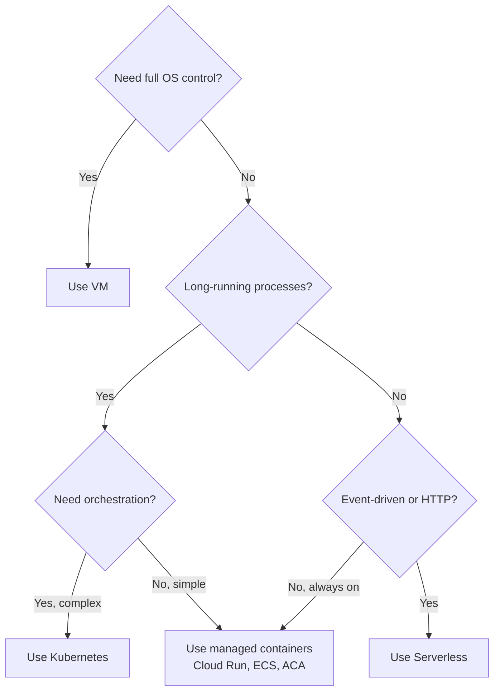

# Compute Models

## What

Cloud platforms offer three main ways to run code: virtual machines, containers, and serverless functions. Each trades off control for convenience.

## The Three Models

### Virtual Machines (VMs)

You get a full operating system. You install everything. You manage everything.

Pros: Full control, any language, any tool, any configuration.
Cons: You patch the OS, manage scaling, handle networking, and pay for idle time.

Examples: AWS EC2, Azure Virtual Machines, Google Compute Engine.

### Containers

You package your app with its dependencies into a container image. The platform runs the container on shared infrastructure.

Pros: Consistent environments, fast startup, easier scaling than VMs, portable across environments.
Cons: You still manage the container orchestration (or pay a managed service to do it).

Examples: Docker, Kubernetes, AWS ECS, Azure Container Apps, Google Cloud Run.

### Serverless / Functions

You write a function. The platform runs it on demand. No servers to manage.

Pros: Zero infrastructure management, scales to zero (no cost when idle), scales automatically, pay only for execution time.
Cons: Cold starts (latency on first request), execution time limits, vendor lock-in, limited local state.

Examples: AWS Lambda, Azure Functions, Google Cloud Functions.

## Decision Tree

## When Each

| Use VMs When                              | Use Containers When                  | Use Serverless When              |
|-------------------------------------------|--------------------------------------|----------------------------------|
| Custom OS or kernel requirements          | Microservices architecture           | Event-driven workloads           |
| Legacy applications that need full OS     | Need consistent dev/prod parity      | HTTP APIs with variable traffic  |
| GPU workloads (ML training)               | CI/CD pipelines                      | Data processing / ETL jobs       |
| Compliance requires dedicated hardware    | Multi-service orchestration needed   | Webhooks, scheduled tasks        |

## Cost Model

- **VMs** — Pay per hour (or second). Running 24/7? You pay 24/7. Reserved instances reduce cost by 30-60% for committed usage.
- **Containers** — Pay for the underlying compute (VMs or serverless). Kubernetes adds management overhead cost. Managed containers (Cloud Run, ACA) simplify billing.
- **Serverless** — Pay per invocation + duration. First 1M requests/month are often free. Cost-effective for spiky or low traffic. Expensive for constant high throughput.

Rule of thumb:
- Low/variable traffic → serverless is cheapest
- Steady, predictable traffic → containers on reserved VMs
- Need maximum control → VMs

## Common Mistakes

- Starting with VMs because they are familiar. If you don't need OS-level control, containers or serverless reduce operational overhead significantly.
- Using serverless for long-running tasks. Most functions have a 15-minute timeout. Use containers for anything longer.
- Ignoring cold start latency. If your serverless function takes 2 seconds to start, your users notice. Keep functions small and warm.
