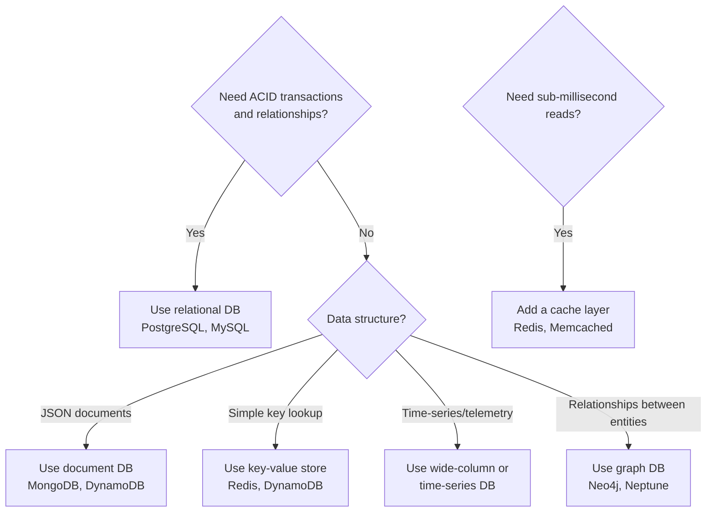

# Storage and Databases

## What

Cloud platforms offer many storage and database options. Picking the right one is a decision that is expensive to reverse. Here is a framework for making that choice.

## Storage Types

### Object Storage

Store files as objects in a flat namespace. Each object has a key, value, and metadata.

Good for: Images, videos, backups, logs, static assets, data lake files.
Not for: File system operations, frequent small reads/writes.

Examples: AWS S3, Azure Blob Storage, Google Cloud Storage.

### Block Storage

Network-attached disk volumes. Like a hard drive for your VM.

Good for: Database storage, boot volumes, applications needing low-latency disk I/O.
Not for: Sharing files between instances.

Examples: AWS EBS, Azure Disk Storage, Google Persistent Disk.

### File Storage

Shared file system accessible by multiple instances simultaneously.

Good for: Shared configuration, content management systems, legacy applications expecting a file system.
Not for: High-throughput object storage workloads.

Examples: AWS EFS, Azure Files, Google Filestore.

## Database Selection

### Relational (SQL)

Structured data with relationships. ACID transactions. Schema enforcement.

Good for: Transactional data (orders, payments, users), complex queries, data integrity requirements.
Not for: Schema flexibility needs, massive write throughput, unstructured data.

Examples: PostgreSQL, MySQL, AWS Aurora, Azure SQL, Cloud SQL.

### NoSQL

#### Document

Store JSON-like documents. Flexible schema. Query by document fields.

Good for: Content management, catalogs, user profiles, rapid iteration on schema.
Not for: Complex joins, multi-document transactions.

Examples: MongoDB, AWS DynamoDB, Azure Cosmos DB, Firestore.

#### Key-Value

Simple lookup by key. Extremely fast reads and writes.

Good for: Session storage, caching, user preferences, configuration.
Not for: Complex queries, relationships between items.

Examples: Redis, DynamoDB, Memcached.

#### Wide-Column

Store data in rows with flexible columns. Optimized for massive write throughput and time-series data.

Good for: Time-series data, IoT data, logging, high-write workloads.
Not for: Complex queries, joins.

Examples: Cassandra, ScyllaDB, Bigtable.

#### Graph

Store entities and relationships. Query patterns like "find all friends of friends."

Good for: Social networks, recommendation engines, fraud detection.
Not for: Simple CRUD, high-volume writes.

Examples: Neo4j, AWS Neptune, Azure Cosmos DB (Gremlin).

### Cache

In-memory data store for fast reads. Not a primary data store.

Good for: Session data, frequently accessed query results, rate limiting counters.
Not for: Persistent data, data that doesn't fit in memory.

Examples: Redis, Memcached.

## Decision Framework

## Common Mistakes

- Using MongoDB for everything because "schema-less." Schema flexibility is not the same as schema anarchy. Even document databases benefit from a consistent structure.
- Skipping the cache. If the same query runs 100 times per second, cache it.
- Picking a database before understanding the data access patterns. Read patterns drive database choice, not data structure.
