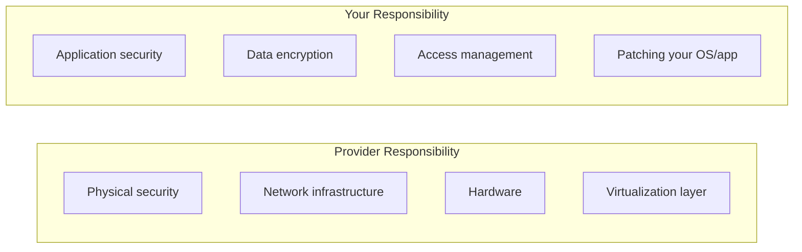

# Cloud Security

## What

Cloud security is a shared responsibility. The cloud provider secures the infrastructure. You secure what you put on it. Understanding where that line is drawn is critical.

## Shared Responsibility Model

The provider keeps the data center running. You keep your application and data safe. The line shifts depending on the service:
- **IaaS (VMs)** — You patch the OS, configure the firewall, manage encryption
- **PaaS (managed databases, containers)** — Provider patches the OS. You configure access and encrypt data.
- **SaaS (managed services)** — Provider handles most security. You manage users and data access.

## IAM — Identity and Access Management

IAM controls who can do what in your cloud account.

### Principle of Least Privilege

Give every user, service, and application the minimum permissions needed. Nothing more.

Bad: An S3 read-only service has `s3:*` (full S3 access).
Good: The same service has `s3:GetObject` on a specific bucket.

### IAM Roles for Services

Services (EC2 instances, Lambda functions, containers) should use IAM roles, not access keys.

- Roles provide temporary credentials that rotate automatically
- Access keys are long-lived and can be leaked
- Never hardcode access keys in code or configuration files

### Groups and Policies

- Put users in groups. Assign policies to groups. Do not assign policies to individual users.
- Use managed policies (cloud-provider-defined) when they fit. Write custom policies when needed.
- Review permissions regularly. Remove unused access.

## Security Groups and Network Security

A security group is a virtual firewall for your resources.

Rules:
- **Default: deny all inbound, allow all outbound.** This is secure by default.
- Add inbound rules for exactly what is needed: port, protocol, source IP range.
- Never open `0.0.0.0/0` (all internet) on database ports (3306, 5432, 27017).
- Restrict SSH (port 22) to specific IP ranges or use a bastion host.

Layer your network security:
- Public subnets: load balancers, web servers
- Private subnets: application servers, databases
- No direct internet access to private subnets

## Encryption

### At Rest

Encrypt data stored on disk. This includes databases, object storage, and file systems.

- Enable encryption by default on all storage services
- Use the cloud provider's managed keys for simplicity
- Use customer-managed keys (KMS) when compliance requires it

### In Transit

Encrypt data moving between client and server, and between services.

- HTTPS/TLS for all external communication
- TLS for service-to-service communication in production
- Enforce TLS versions (1.2 minimum)

## Common Mistakes

- Using root account credentials for daily work. Create IAM users with specific roles instead.
- Leaving security groups wide open during development and forgetting to tighten them for production.
- Storing secrets in code, environment variables in CI/CD configs, or unencrypted S3 buckets. Use a secrets manager.
- Assuming the cloud provider handles all security. They handle their layer. You handle yours.
- Not enabling audit logging (CloudTrail, Azure Activity Log). Without it, you cannot investigate incidents.
