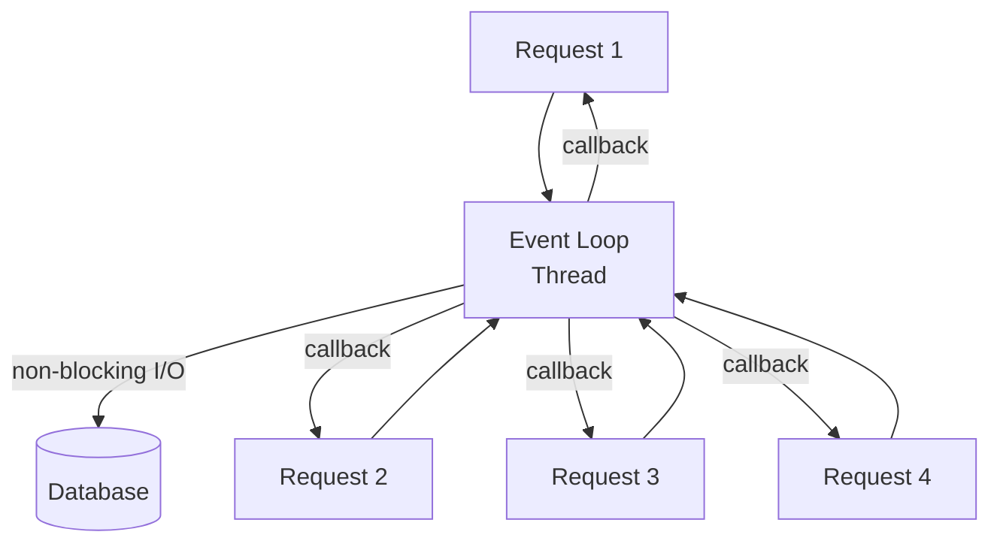

# Reactive Programming

## What

Reactive programming is an approach that deals with asynchronous data streams and the propagation of change. Instead of pulling data, you subscribe to streams and react as data arrives.

## The Reactive Manifesto

Four traits:

1. **Responsive** — The system responds in a timely manner
2. **Elastic** — The system stays responsive under varying load
3. **Resilient** — The system stays responsive when components fail
4. **Message-driven** — Components communicate via asynchronous messages

## Event Loop Model

Instead of one thread per request, reactive systems use a small number of event loop threads that handle many connections.



The event loop never blocks. When an I/O operation starts, it registers a callback and moves to the next request. When the I/O completes, the callback runs on the event loop.

This is how Node.js, Nginx, and Netty work. A few threads handle tens of thousands of concurrent connections.

## Backpressure

When the producer emits data faster than the consumer can process it, you get backpressure. Reactive systems handle this explicitly.

Options:
- **Buffer** — Queue the data (risk: memory overflow)
- **Drop** — Discard what you cannot process
- **Signal** — Tell the producer to slow down (best option)

Backpressure is the key difference between reactive streams and simple event emitters. Without it, a fast producer can crash a slow consumer.

## When Reactive

Use reactive when:
- High I/O concurrency (thousands of concurrent connections, WebSockets)
- Need to handle many slow consumers (streaming data)
- Real-time data pipelines (market data, sensor data, chat)
- You need predictable resource usage under load

## When Not Reactive

Avoid reactive when:
- Simple CRUD APIs with low concurrency (thread-per-request is fine)
- CPU-bound work (reactive doesn't help with computation)
- Your team is not experienced with async programming (the debugging complexity is real)

Reactive adds cognitive overhead. Every operation is asynchronous. Stack traces are harder to read. Debugging requires understanding the stream lifecycle. Use it when the problem demands it, not because it sounds modern.

## Per-Language Example

```javascript
// RxJS (JavaScript)
fromEvent(button, 'click')
  .pipe(
    throttleTime(1000),
    map(event => event.target.value),
    filter(value => value.length > 2),
    switchMap(query => searchAPI(query))
  )
  .subscribe(results => displayResults(results));
```

```java
// Project Reactor (Java / Spring WebFlux)
webClient.get()
    .uri("/api/users")
    .retrieve()
    .bodyToFlux(User.class)
    .filter(user -> user.isActive())
    .take(100)
    .subscribe(user -> processUser(user));
```

```python
# Python with asyncio (not reactive streams, but async I/O)
async def fetch_all(urls):
    async with aiohttp.ClientSession() as session:
        tasks = [fetch_url(session, url) for url in urls]
        return await asyncio.gather(*tasks)
```

## Common Mistakes

- Blocking the event loop. One blocking call (synchronous database query, file read) freezes everything. Every I/O operation must be non-blocking.
- Using reactive for everything. A CRUD API does not need reactive streams. A chat server does.
- Ignoring error handling in streams. Unhandled errors in reactive streams silently stop the stream. Always add `onErrorResume` or equivalent.
