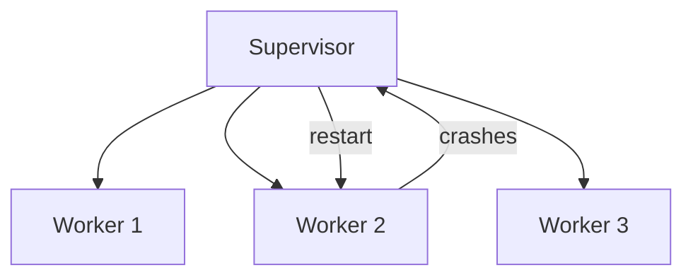

# Actor Model

## What

The actor model is a concurrency model where "actors" are the fundamental unit of computation. Each actor has private state, processes messages one at a time, and communicates only through asynchronous messages.

## Core Concept

An actor is:
- **State** — Private data that no one else can access
- **Behavior** — Logic that processes messages
- **Mailbox** — A queue of incoming messages

```mermaid
flowchart LR
    A1[Actor A<br/>state: {count: 5}<br/>mailbox: [msg1, msg2]] 
    A2[Actor B<br/>state: {items: []}<br/>mailbox: [msg3]]
    A1 -->|message| A2
    A2 -->|message| A1
```

Rules:
1. Actors communicate only by sending messages. No shared memory.
2. Each actor processes one message at a time. No locks needed.
3. An actor's state is private. No other actor can read or modify it.
4. When an actor processes a message, it can: change its state, send messages to other actors, or create new actors.

## Why No Locks

Traditional concurrency uses shared memory and locks:

```
Thread 1: lock(mutex); balance -= 10; unlock(mutex);
Thread 2: lock(mutex); balance += 20; unlock(mutex);
```

Problems: deadlocks, race conditions, priority inversion.

The actor model avoids all of this. No shared state means no locks. Each actor processes messages sequentially, so its state is always consistent.

## Supervision

Actors form a hierarchy. Parent actors supervise child actors. When a child fails, the parent decides what to do:

- **Restart** — Kill the child, create a new one with fresh state
- **Resume** — Keep the child, skip the failed message
- **Stop** — Kill the child permanently
- **Escalate** — Let the grandparent decide



This is the "let it crash" philosophy. Instead of defensive programming (try-catch everything), accept that failures happen and let supervisors handle recovery.

## When to Use Actors

- **Distributed systems** — Actors can live on different machines. Message passing works across the network transparently.
- **High concurrency with state** — Game servers, chat systems, IoT device management. Each entity (player, chat room, device) is an actor.
- **Fault-tolerant systems** — Supervision hierarchies provide structured error recovery.
- **Event-driven workflows** — Each workflow step is an actor processing events.

## When Not to Use Actors

- **Simple request-response** — Actors add complexity. A thread pool is simpler.
- **Data-heavy batch processing** — Actors are not designed for bulk data transformation.
- **Your team is new to distributed systems** — The mental model is different. There is a learning curve.

## Implementations

- **Erlang/Elixir** — Built on the actor model. The gold standard for fault-tolerant systems.
- **Akka (Scala/Java)** — JVM actor framework. Widely used.
- **Microsoft Orleans (C#)** — Virtual actor model. Simplifies distributed actor programming.
- **Proto Actor (Go/C#/Kotlin)** — Cross-platform actor framework.

```scala
// Akka example
class OrderActor extends Actor {
  var orders: List[Order] = List()

  def receive: Receive = {
    case PlaceOrder(order) =>
      orders = orders :+ order
      sender() ! OrderConfirmed(order.id)
    case GetOrders =>
      sender() ! OrdersList(orders)
  }
}
```

## Common Mistakes

- Sharing mutable state between actors. If two actors can modify the same data, you defeated the purpose.
- Blocking inside an actor. Actors should process messages quickly. Offload blocking work to a separate thread pool or actor.
- Creating too many fine-grained actors. Each actor has overhead. Group related state into one actor when it makes sense.
