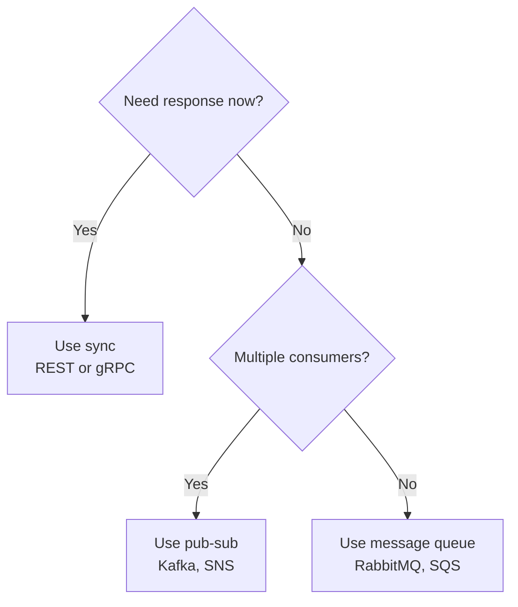

# Communication Patterns

## What

Distributed systems need to communicate. The two fundamental patterns are synchronous (call and wait) and asynchronous (send and move on).

## Synchronous Communication

The caller sends a request and waits for a response before continuing.

```
Service A --request--> Service B
Service A <--response-- Service B
```

### REST

The most common synchronous pattern. HTTP-based, human-readable, widely supported.

Good for: CRUD operations, public APIs, simple request-response.

### gRPC

Uses Protocol Buffers and HTTP/2. Smaller payloads, faster serialization, bi-directional streaming, strong typing via `.proto` files.

Good for: Service-to-service communication, low-latency requirements, streaming data.

```
// proto file
service OrderService {
  rpc GetOrder(OrderRequest) returns (OrderResponse);
  rpc StreamOrders(StreamRequest) returns (stream OrderResponse);
}
```

## Asynchronous Communication

The sender publishes a message and does not wait for a response. The receiver processes it when ready.

```
Service A --message--> [Queue/Topic] --message--> Service B
Service A continues immediately
```

### Message Queue (Point-to-Point)

One producer, one consumer per message. The message is removed after consumption.

Good for: Task distribution, work queues, load leveling.

Examples: RabbitMQ, Amazon SQS, Azure Service Bus.

### Pub-Sub (Publish-Subscribe)

One producer, multiple consumers. Each consumer gets a copy of the message.

Good for: Event notification, fan-out, decoupling producers from consumers.

Examples: Kafka, Amazon SNS, Google Pub/Sub.

## When Which

| Scenario                        | Pattern          |
|---------------------------------|------------------|
| User needs immediate response   | Synchronous      |
| Background processing           | Async queue      |
| Notify multiple services        | Pub-sub          |
| Service-to-service query        | Synchronous      |
| High throughput, can tolerate delay | Async        |
| Need exactly-once processing    | Async with queue |
| Complex query across services   | Synchronous or composition |



## Trade-offs

### Synchronous
- Pros: Simple mental model, immediate feedback, easy error handling
- Cons: Tight coupling, caller is blocked, cascading failures, harder to scale

### Asynchronous
- Pros: Loose coupling, natural buffering, resilience to downstream failures, better throughput
- Cons: Eventual consistency, harder to debug, message ordering challenges, requires message broker infrastructure

## Common Mistakes

- Using synchronous calls for everything. If the user doesn't need to wait, don't make them wait.
- Using async for simple CRUD. Not everything needs a message queue. Add complexity when the problem demands it.
- Not handling failures in async. What happens if the consumer crashes after reading but before processing? Use acknowledgment and retry patterns.
- Ignoring message ordering. If order matters, design for it. Most queues don't guarantee order by default.
