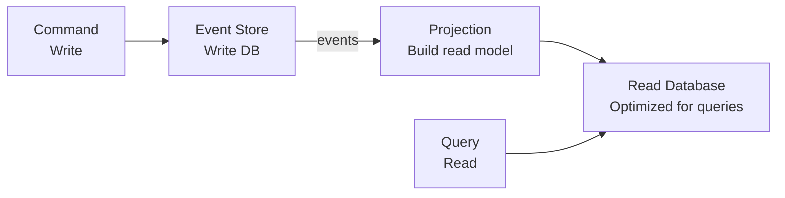

# Event-Driven Architecture

## What

Event-driven architecture (EDA) is a design where services communicate by producing and consuming events. An event is a fact that something happened: "OrderPlaced", "PaymentReceived", "UserSignedUp".

## Why Events

Instead of Service A calling Service B directly, Service A publishes an event. Any interested service can react to it. The producer doesn't know or care who consumes the event.

This decouples services. You can add a new consumer without changing the producer.

## Event Sourcing

Instead of storing current state, store the sequence of events that led to the current state.

Traditional: Store the current balance in a row.
Event sourcing: Store every transaction. The balance is the sum of all transactions.

```
Events:
  AccountCreated(account=42, initial_balance=0)
  Deposited(account=42, amount=100)
  Withdrawn(account=42, amount=30)
  Deposited(account=42, amount=50)

Current state: balance = 0 + 100 - 30 + 50 = 120
```

Benefits:
- Complete audit trail — you know exactly what happened and when
- Time travel — replay events to any point in time
- Event replay — rebuild state from scratch if the database is corrupted
- Natural integration — other services consume the same events

Costs:
- More storage — every change is an event, not just the latest state
- Complexity — queries against current state require building a "projection" (read model)
- Eventual consistency — projections may lag behind events

## CQRS

Command Query Responsibility Segregation: separate the write model from the read model.



- **Commands** mutate state. They go through the write model, which produces events.
- **Queries** read state. They go through the read model, which is a projection optimized for queries.

Why: The write model and read model have different needs. Writes need consistency and validation. Reads need speed and denormalization. CQRS lets each be optimized independently.

## Kafka Mental Model

Apache Kafka is a distributed event streaming platform. Mental model: a commit log.

```
Topic: "orders"
Partition 0: [order-1] [order-3] [order-5] [order-7]
Partition 1: [order-2] [order-4] [order-6] [order-8]
```

- **Topic** — A named stream of events (like a table in a database)
- **Partition** — Topics are split into partitions for parallelism. Each partition is an ordered, append-only log.
- **Consumer Group** — A set of consumers that share the work of reading a topic. Each partition is consumed by one consumer in the group.
- **Offset** — The position of a consumer in a partition. Like a bookmark.

Key properties:
- Events are retained for a configurable period (not deleted after consumption)
- Multiple consumer groups can read the same topic independently
- Order is guaranteed within a partition, not across partitions

## When to Use EDA

- Multiple services need to react to the same event
- You need audit trails and replay capability
- Your system has high write throughput with diverse read patterns
- Services need to be loosely coupled

## When Not to Use EDA

- Simple request-response workflows where the user needs immediate feedback
- Small systems where the overhead isn't justified
- Teams that are new to distributed systems (the debugging complexity is significant)
