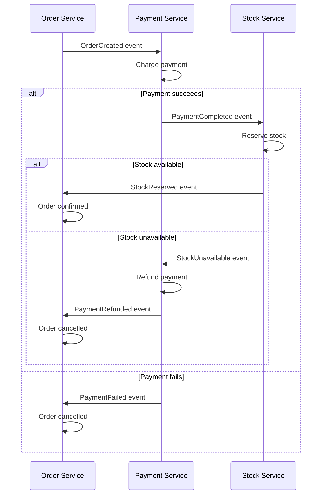
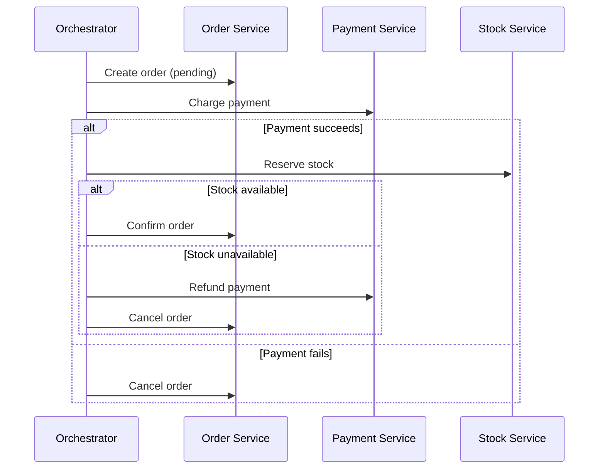

# Saga Pattern

## What

A saga is a pattern for managing distributed transactions across multiple services without a global lock. Instead of one big transaction, you break it into a sequence of local transactions, each with a compensating action to undo it if something fails.

## The Problem

In a monolith, you wrap related operations in a database transaction. Either they all succeed or they all roll back.

In a distributed system, Service A writes to its database, then Service B writes to its database. There is no shared transaction. If Service B fails, Service A's write is already committed. The system is in an inconsistent state.

## Two Saga Styles

### Choreography

Each service emits events. Other services listen and react. No central coordinator.

Pros: Simple, no single point of failure, loosely coupled.
Cons: Hard to see the full flow, difficult to debug, risk of cyclic dependencies.

### Orchestration

A central orchestrator tells each service what to do and handles failures.

Pros: Clear flow, easy to debug, central place for retries and timeouts.
Cons: Orchestrator is a single point of failure (mitigate with replication), tighter coupling to orchestrator.

## Compensating Actions

Each step has an undo operation. Compensation is not a rollback — it is a semantic undo. If you charged $50, the compensation is a $50 refund, not a database rollback.

| Action              | Compensation        |
|---------------------|---------------------|
| Create order        | Cancel order        |
| Charge payment      | Refund payment      |
| Reserve stock       | Release stock       |
| Ship order          | Initiate return     |
| Send confirmation   | Send cancellation   |

Compensations must be:
- **Idempotent** — Safe to call multiple times
- **Communtative** — Safe to execute in any order
- **Retryable** — If the compensation fails, retry it

## When to Use Sagas

- Any business process that spans multiple services
- When you need consistency but cannot use a single database transaction
- When compensating actions are feasible (you can refund, cancel, release)

## Common Mistakes

- Not making compensating actions idempotent. Network retries will call them multiple times.
- Using choreography for complex flows with many services. An orchestrator is easier to understand.
- Forgetting to handle the case where a compensation itself fails. Log it, alert on it, and have a manual process.
- Not storing saga state durably. If the orchestrator crashes mid-saga, it must be able to resume.
