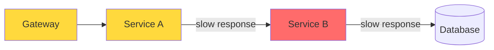

# Failure Modes

## What

Distributed systems fail in specific, predictable ways. Understanding these patterns helps you design systems that degrade gracefully instead of catastrophically.

## Cascading Failures

Service A depends on Service B. Service B slows down. Service A's threads pile up waiting for B. Service A runs out of threads and becomes unresponsive. Now anything depending on A also fails.



One slow component drags everything down.

**Fix:** Timeouts and circuit breakers. If B doesn't respond in 2 seconds, stop calling it. Return a fallback or error immediately.

## Timeouts

Every network call needs a timeout. No exceptions.

- **Connection timeout** — How long to wait to establish a connection (short: 1-5 seconds)
- **Read timeout** — How long to wait for a response after connecting (depends on the operation: 5-30 seconds)
- **Overall timeout** — Total time including retries (cap it)

Without timeouts, a thread can wait forever. With them, the thread fails fast and moves on.

## Bulkhead Pattern

Isolate different parts of your system so a failure in one doesn't take down the rest.

Named after ship bulkheads — walls that compartmentalize a ship. If one compartment floods, the ship stays afloat.

Implementation:
- **Thread pool bulkhead** — Separate thread pools for different downstream services. If Service B's pool is exhausted, Service C still has threads available.
- **Semaphore bulkhead** — Limit concurrent calls to a specific service.
- **Process/container bulkhead** — Run different services on different machines.

```python
# Thread pool bulkhead
pool_payments = ThreadPoolExecutor(max_workers=10)
pool_notifications = ThreadPoolExecutor(max_workers=5)

# If payment service is slow, it uses up its own pool
# Notification service remains unaffected
pool_payments.submit(call_payment_service, order)
pool_notifications.submit(send_notification, order)
```

## Circuit Breaker

A switch that stops calling a failing service, giving it time to recover.

```
CLOSED ──(error threshold exceeded)──> OPEN
OPEN ──(timeout elapsed)──> HALF-OPEN
HALF-OPEN ──(success)──> CLOSED
HALF-OPEN ──(failure)──> OPEN
```

- **Closed** — Normal operation. Requests go through. Count failures.
- **Open** — Stop sending requests. Return fallback immediately. Wait for a timeout.
- **Half-Open** — Try one request. If it succeeds, close the circuit. If it fails, stay open.

The circuit breaker protects both sides: the caller doesn't waste resources, and the failing service doesn't get more load.

## Chaos Engineering

The practice of deliberately injecting failures to find weaknesses before they find you.

Start with:
- Kill a service instance randomly in staging
- Add latency to a database connection
- Simulate a network partition between services
- Fill up a disk

Tools: Chaos Monkey (Netflix), Gremlin, AWS Fault Injection Simulator, LitmusChaos.

Principles:
1. Start small (one experiment at a time, in non-production first)
2. Define a steady state (what "normal" looks like)
3. Inject the failure
4. Observe if the system maintains the steady state
5. If not, fix the weakness and try again

## Common Mistakes

- Not setting timeouts. "It should be fast" is not a timeout.
- Setting timeouts too high. A 60-second timeout means your thread is blocked for 60 seconds when the service is down. Set it to what your users can tolerate.
- Not having a fallback. When the circuit is open, what do you return? A cached response, a default value, or a clear error. Decide upfront.
- Testing only the happy path. Your system will spend more time in degraded states than in perfect operation. Test failures.
