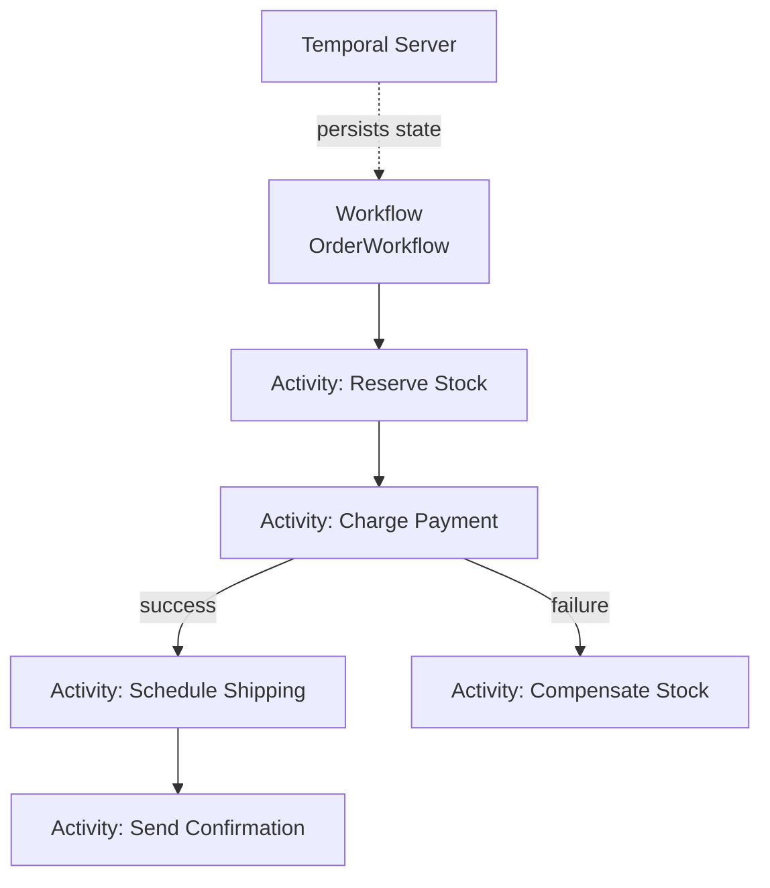

# Workflow Orchestration

## What

Workflow orchestration is a pattern for managing long-running, multi-step business processes that span multiple services. It provides durability — if the process crashes, it resumes where it left off.

## The Problem

"Process an order" sounds simple. It's actually: validate order → reserve stock → charge payment → schedule shipping → send confirmation. Each step can fail, timeout, or need a retry. If the server crashes after step 3, you need to resume from step 4, not restart.

Doing this with ad-hoc code is fragile. You end up with scattered state management, custom retry logic, and no visibility into in-flight workflows.

## Temporal Model

Temporal is the leading workflow orchestrator. It separates logic into two parts:

### Workflows

The definition of your process. Written as normal code, but with constraints:
- Deterministic (no random numbers, no current time, no network calls)
- Durable (the state is persisted automatically)
- Replayable (Temporal reconstructs state by replaying the event history)

```python
@workflow.defn
class OrderWorkflow:
    @workflow.run
    async def run(self, order: Order) -> str:
        # Step 1
        stock_result = await workflow.execute_activity(
            reserve_stock, order, start_to_close_timeout=timedelta(seconds=10)
        )
        
        # Step 2
        payment_result = await workflow.execute_activity(
            charge_payment, order, start_to_close_timeout=timedelta(seconds=30)
        )
        
        # Step 3
        shipping_result = await workflow.execute_activity(
            schedule_shipping, order, start_to_close_timeout=timedelta(seconds=10)
        )
        
        return shipping_result.tracking_id
```

### Activities

The actual work: API calls, database writes, sending emails. Activities can fail and are retried by the framework.

```python
@activity.defn
async def reserve_stock(order: Order) -> bool:
    # Real work: call stock service, write to DB
    response = await stock_client.reserve(order.items)
    return response.success
```

## Key Concepts

- **Durable execution** — The workflow is guaranteed to run to completion. Server crashes, network partitions, and process restarts don't lose progress.
- **Event sourcing** — Temporal stores the history of what happened, not just the current state. You can see every step, decision, and result.
- **Retries** — Configure per-activity retry policies. Maximum attempts, backoff strategy, non-retryable errors.
- **Timeouts** — Set timeouts on each activity. If it doesn't complete in time, it's treated as a failure.
- **Signals and queries** — External systems can interact with a running workflow (send a signal to cancel, query the current status).



## When to Use an Orchestrator

- **Multi-step business processes** — Order processing, loan applications, user onboarding, data pipelines
- **Long-running processes** — Minutes, hours, or days (not milliseconds)
- **Processes that need durability** — Cannot lose progress on crash
- **Complex retry and compensation logic** — Different retry strategies per step, sagas with compensating actions

## When Not to Use

- **Simple request-response** — If it takes milliseconds and doesn't cross services, you don't need an orchestrator
- **Simple scheduled tasks** — Use a cron job or a task queue
- **Real-time processing** — Temporal adds latency. Not suitable for sub-second processing

## Alternatives

- **Temporal** — Most feature-rich, strong consistency, open source
- **AWS Step Functions** — Managed, integrates with AWS, visual editor, JSON-based state machines
- **Camunda / Zeebe** — BPMN standard, visual workflow designer
- **Cadence** — Temporal's predecessor (made by the same team at Uber)
