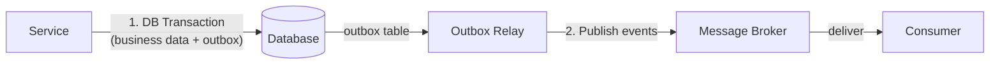

# Message Reliability

## What

When services communicate via asynchronous messaging (pub/sub, event-driven), messages can be lost, duplicated, or delivered out of order. Message reliability patterns ensure messages are delivered exactly as intended — no loss, safe duplication, and correct ordering.

This builds on [Event-Driven Architecture](./02-event-driven.md) (which covers the "what" and "why" of events) by addressing the "how do I make it reliable" question.

## The Core Problem: At-Least-Once Delivery

Most message brokers (RabbitMQ, Kafka, SQS) guarantee **at-least-once delivery**. This means a message will arrive, but it might arrive more than once.

```
Producer → "OrderPlaced" → Broker → Consumer

What can go wrong:
1. Producer crashes after sending → message might be lost
2. Broker crashes → message might be lost (if not persisted)
3. Consumer crashes after processing but before acknowledging → message is redelivered (duplicate)
```

Your consumer must handle duplicates gracefully. This is called **idempotency**.

## The Outbox Pattern

### The Dual-Write Problem

When a service needs to both write to its database AND publish a message, you need two operations:

```python
# PROBLEM: These are two separate operations. Either can fail.
db.update("orders", order_id, status="confirmed")
queue.publish("OrderConfirmed", {"id": order_id})
```

If the database commit succeeds but the publish fails, the order is confirmed but no one knows. If the publish succeeds but the database rolls back, consumers react to an event that didn't happen.

### Solution: Transactional Outbox

Write the message to an "outbox" table in the **same database transaction** as the business operation. Then a separate process reads the outbox and publishes to the broker.



```sql
-- Single transaction
BEGIN;
UPDATE orders SET status = 'confirmed' WHERE id = 42;
INSERT INTO outbox (aggregate_id, event_type, payload) 
  VALUES (42, 'OrderConfirmed', '{"id": 42}');
COMMIT;
```

```python
# Separate process: Outbox Relay
def relay_outbox():
    while True:
        messages = db.query("SELECT * FROM outbox WHERE published = false LIMIT 100")
        for msg in messages:
            queue.publish(msg.event_type, msg.payload)
            db.update("outbox", msg.id, published=true)
```

The outbox guarantees: if the database write succeeded, the event will eventually be published. No dual-write problem.

## Idempotent Consumers

When a message is redelivered (due to crash, network retry, broker restart), the consumer must not process it twice.

### Pattern: Processed Message Tracker

```python
def handle_order_confirmed(message):
    message_id = message.headers["message_id"]

    # Check if already processed
    if db.query("SELECT 1 FROM processed_messages WHERE id = ?", message_id):
        return  # Already processed, skip

    # Process the message
    update_inventory(message.order_id)
    send_notification(message.order_id)

    # Record as processed
    db.insert("processed_messages", id=message_id)
    db.commit()
```

The `processed_messages` table is your deduplication key. Use the broker-assigned message ID or a deterministic ID from your domain.

## Dead Letter Queue (DLQ)

When a message fails repeatedly (poison message), stop retrying and move it to a dead letter queue for investigation.

```text
Queue → Consumer (fails) → Retry (fails) → Retry (fails) → DLQ
```

DLQ rules:
- **Max retries** — After N attempts, move to DLQ (typically 3-5)
- **Manual intervention** — A human or dashboard reviews DLQ messages
- **Replay capability** — Fix the bug, replay the message from DLQ back to the queue

Without a DLQ, a poison message blocks the queue forever (or fills up storage with endless retries).

## Message Ordering

Most brokers do NOT guarantee global ordering across partitions. They guarantee ordering **within a partition** (Kafka) or **within a queue** (RabbitMQ with single consumer).

Rules:
1. **Use a partition key** — Messages with the same key (e.g., `order_id`) go to the same partition, preserving order for that entity
2. **Don't rely on cross-entity ordering** — "OrderConfirmed for order 42" and "PaymentReceived for order 43" have no guaranteed order
3. **Design for out-of-order** — If order matters, include version numbers or timestamps in the message and handle stale messages

```python
def handle_event(event):
    # Check if this is a stale event
    current_version = db.get_version(event.aggregate_id)
    if event.version < current_version:
        return  # Stale event, ignore
    process(event)
```

## Common Mistakes

- **Dual-write without outbox.** Writing to the database and publishing to the broker as separate operations. Eventually you'll lose or phantom-publish events.
- **Consumers that aren't idempotent.** Assuming "at-least-once" means "exactly-once." It doesn't. Redeliveries will happen.
- **No DLQ.** A poison message silently blocks the queue or exhausts storage. Always set a max retry and DLQ.
- **Ignoring ordering.** Building logic that assumes event A always arrives before event B. It doesn't — design for out-of-order delivery.
