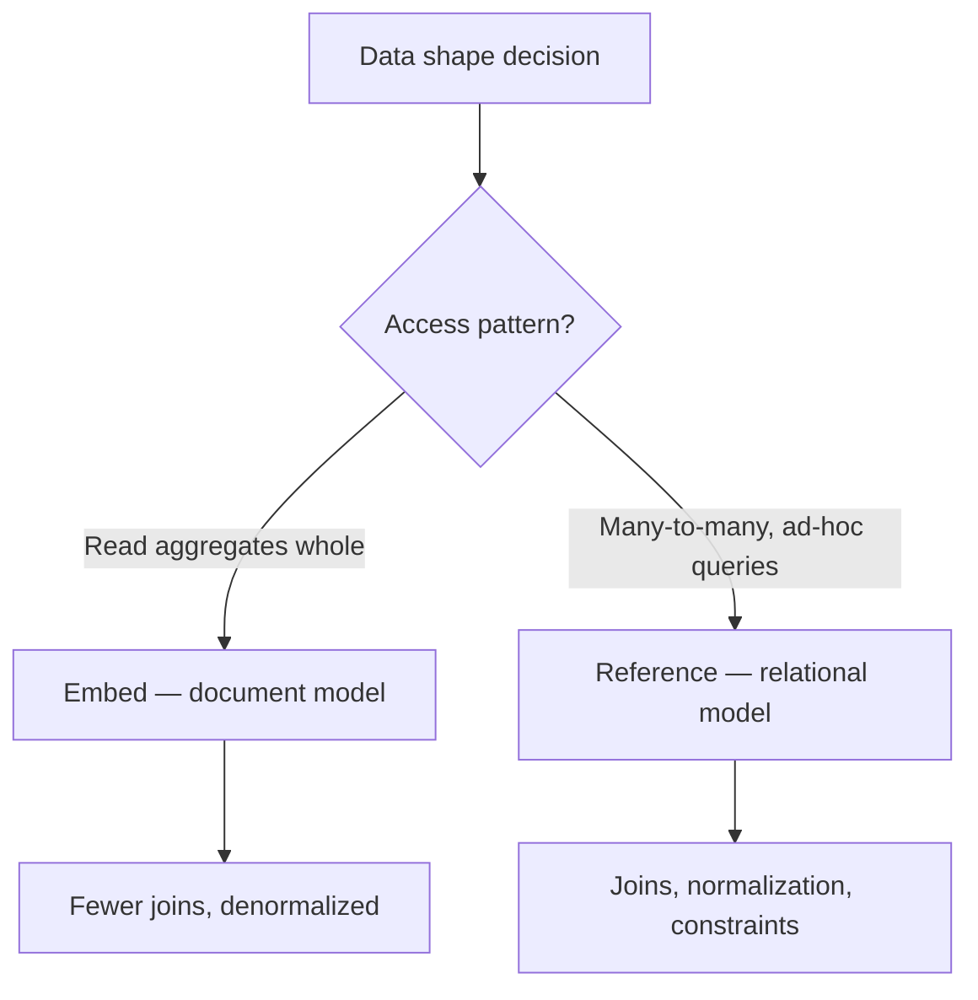

# NoSQL vs Relational

## What

Relational databases store rows in tables with a fixed schema. MongoDB stores documents in collections with a flexible schema. The right choice depends on your data shape and access patterns, not on hype.

## Why It Matters

Schema choice shapes everything downstream: how you query, how you join, how you scale. Relational databases enforce structure and give you ACID transactions across tables. Document databases let the data shape follow your domain and remove the cost of joins for read-heavy workloads.

Pick wrong and you fight the database daily. Pick right and most queries become trivial.

## How It Works

### The Same Data, Two Shapes

A user with addresses in PostgreSQL:

```sql
CREATE TABLE users (
  id SERIAL PRIMARY KEY,
  email TEXT UNIQUE NOT NULL
);

CREATE TABLE addresses (
  id SERIAL PRIMARY KEY,
  user_id INT REFERENCES users(id),
  city TEXT,
  country TEXT
);
```

Reading a user with addresses requires a `JOIN`. In MongoDB, addresses that always belong to one user become an embedded array:

```javascript
{
  _id: ObjectId("..."),
  email: "ada@example.com",
  addresses: [
    { city: "London", country: "UK" },
    { city: "Paris", country: "France" }
  ]
}
```

One read returns the whole aggregate. No join.

### Documents and BSON

MongoDB stores documents in BSON (binary JSON). You get strings, numbers, booleans, arrays, nested objects, dates, and special types like `ObjectId`. A document can be up to 16 MB — enough for any reasonable aggregate.

### Flexible Schema, Not No Schema

Every document in a collection can have different fields. That is flexibility, and it is also risk: nothing stops one document from storing `email` as a number. Enforce structure at the application layer with schema validation (Mongoose, Zod, class validators) or with MongoDB's collection validators.

### What You Keep and What You Give Up



Relational strengths: strict constraints, mature tooling, ad-hoc SQL joins, multi-row ACID by default.

MongoDB strengths: documents match application objects, horizontal scaling built in, flexible fields for evolving products, fast writes for append-heavy workloads.

## Common Mistakes

- **Using MongoDB to avoid design.** You still model relationships — embedding vs referencing is a real schema decision.
- **Treating it as a cache with persistence.** It is a database with transactions, indexes, and aggregation. Use them.
- **Embedding unbounded arrays.** A `comments` array that grows forever will hit the 16 MB limit and rewrite the whole document on each push. Reference instead.
- **Assuming no ACID.** MongoDB has supported multi-document ACID transactions since 4.0.
