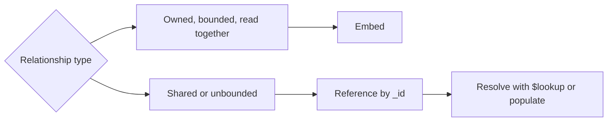

# MongoDB Data Modeling

## What

Data modeling in MongoDB means deciding, per collection, what a document represents and how documents relate: embed related data inside a document, or reference it by `_id` in another collection.

## Why It Matters

In relational design you normalize first and join at query time. In MongoDB you model for your read and write patterns — the queries you run every day decide the shape. Good modeling makes queries cheap. Bad modeling forces client-side joins, unbounded arrays, and update anomalies.

## How It Works

### Rule of Thumb: What Is Read Together, Embed Together

If a piece of data is always fetched with its parent and is owned by the parent, embed it.

```javascript
// order with embedded line items — read in one query
{
  _id: ObjectId("..."),
  userId: ObjectId("..."),
  status: "paid",
  items: [
    { sku: "TS-01", name: "T-Shirt", qty: 2, price: 350 },
    { sku: "MUG-9", name: "Mug", qty: 1, price: 199 }
  ],
  total: 899,
  createdAt: ISODate("2026-01-15T10:00:00Z")
}
```

The line items have no meaning outside this order, and the order is always read with them. Embedding also snapshots `price` — a genuine business rule, not a compromise.

### Reference When Data Is Shared or Unbounded



A product appears in thousands of orders and is edited independently — it must be its own collection. A comments list grows without limit — reference it from the post.

```javascript
// post references comments, comments reference author
{
  _id: ObjectId("..."),
  title: "Bun + Elysia notes",
  commentIds: [ObjectId("..."), ObjectId("...")]
}
```

### The Key Patterns Worth Knowing

| Pattern | Problem it solves | Example |
|---------|------------------|---------|
| Attribute | Heterogeneous items in one catalog | `type: "book"` vs `type: "laptop"` with different fields |
| Bucket | High-volume time-series | 100 sensor readings per bucket document |
| Outlier | A few huge documents break norms | Celebrity followers handled separately |
| Subset | Keep hot fields in one place | Latest 10 reviews embedded, rest referenced |
| Computed | Recomputed-on-read is expensive | Store `total` when written |

### Indexes Model With the Schema

Queries decide indexes. An index on `{ userId: 1, createdAt: -1 }` serves "orders of a user, newest first." Index every foreign key you filter on (`userId` in orders), every unique field (`email` in users), and compound indexes in query-field order. Every index costs writes and RAM — index for the queries you actually run, measured with `explain()`.

## Common Mistakes

- **Blind normalization.** Splitting everything into micro-collections rebuilds a relational schema without joins. Painful.
- **Embedding shared data.** Duplicating a product name into 10k orders means 10k updates when the name changes. Reference instead.
- **Massive arrays.** Each push rewrites the array. Unbounded growth belongs in its own collection.
- **Forgetting indexes until production.** A collection scan over 1M documents takes seconds; over an index, milliseconds.
