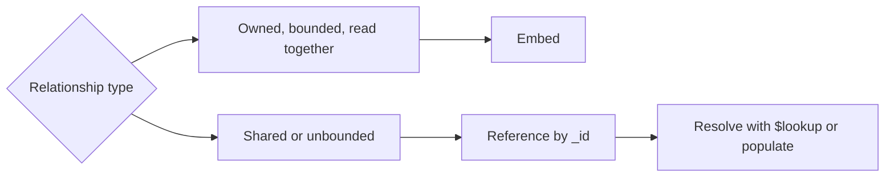

# MongoDB Data Modeling

## What

Data modeling in MongoDB means deciding, per collection, what a document represents and how documents relate: embed related data inside a document, or reference it by `_id` in another collection.

## Why It Matters

In relational design you normalize first and join at query time. In MongoDB you model for your read and write patterns — the queries you run every day decide the shape. Good modeling makes queries cheap. Bad modeling forces client-side joins, unbounded arrays, and update anomalies.

## How It Works

Examples run against the sample dataset from [NoSQL vs Relational](01-nosql-vs-relational.md) (`users`, `products`, `orders`), freshly loaded.

### Rule of Thumb: What Is Read Together, Embed Together

If a piece of data is always fetched with its parent and is owned by the parent, embed it:

```javascript
// order with embedded line items — read in one query
{
  _id: "A", userId: 1, status: "paid",
  items: [
    { sku: "TS-01", name: "T-Shirt", qty: 2, price: 350 },
    { sku: "MUG-9", name: "Mug",     qty: 1, price: 199 }
  ],
  total: 899, createdAt: ISODate("2026-01-15T10:00:00Z")
}
```

The line items have no meaning outside this order, and the order is always read with them. Embedding also snapshots `price` — a genuine business rule, not a compromise.

### Working With Embedded Data

Query into arrays with dot paths or `$elemMatch` when conditions must hold on the *same* element:

```javascript
// any order containing a T-Shirt line
db.orders.find({ "items.sku": "TS-01" })
// → A, D

// SAME element must be a Mug line with qty ≥ 2 — $elemMatch, not two dot paths
db.orders.find({
  items: { $elemMatch: { sku: "MUG-9", qty: { $gte: 2 } } }
})
// → C only (A has MUG-9 qty 1)

// project just the matching element
db.orders.find(
  { _id: "A", "items.sku": "MUG-9" },
  { "items.$": 1 }
)
// → { _id: "A", items: [ { sku: "MUG-9", name: "Mug", qty: 1, price: 199 } ] }
```

Update array elements with `$push`, `$pull`, and the positional `$` operator:

```javascript
// add a line item to order B — keep the computed total in sync in the same update
db.orders.updateOne(
  { _id: "B" },
  { $push: { items: { sku: "MUG-9", name: "Mug", qty: 1, price: 199 } },
    $inc: { total: 199 } }
)
// order B: items [Cap, Mug], total 299 → 498

// remove a line item and its value from the total
db.orders.updateOne(
  { _id: "A" },
  { $pull: { items: { sku: "MUG-9" } },
    $inc: { total: -199 } }
)
// order A: items [T-Shirt], total 899 → 700

// modify ONE matching element — the positional $ matches the item the filter found
db.orders.updateOne(
  { _id: "D", "items.sku": "TS-01" },
  { $inc: { "items.$.qty": -1, total: -350 } }
)
// order D's T-Shirt line: qty 1 → 0, total 948 → 598
```

Note the pattern: computed fields (`total`) are denormalized, so **every item change must adjust them in the same update** — the database will not do it for you.

### Reference When Data Is Shared or Unbounded



A product appears in thousands of orders and is edited independently — it must be its own collection. A comments list grows without limit — reference it from the post.

Resolving references — two ways:

```javascript
// 1. application-side join — two round trips
const order = db.orders.findOne({ _id: "D" })
db.users.findOne({ _id: order.userId })
// → { _id: 3, name: "Alan Turing", email: "alan@example.com", ... }

// 2. server-side join — one round trip
db.orders.aggregate([
  { $match: { _id: "D" } },
  { $lookup: {
      from: "users",
      localField: "userId",
      foreignField: "_id",
      as: "user"
  } },
  { $project: { total: 1, "user.name": 1, "user.email": 1 } }
])
// → [{ _id: "D", total: 948, user: [ { name: "Alan Turing", email: "alan@example.com" } ] }]
```

Application-side when you already have the parent in hand or need per-document logic; `$lookup` when the database can do it in one pass.

### The Key Patterns Worth Knowing

| Pattern | Problem it solves | Example |
|---------|------------------|---------|
| Attribute | Heterogeneous items in one catalog | `type: "book"` vs `type: "laptop"` with different fields |
| Bucket | High-volume time-series | 100 sensor readings per bucket document |
| Outlier | A few huge documents break norms | Celebrity followers handled separately |
| Subset | Keep hot fields in one place | Latest 10 reviews embedded, rest referenced |
| Computed | Recomputed-on-read is expensive | Store `total` when written |

### Indexes Model With the Schema

Queries decide indexes. Index every foreign key you filter on, every unique field, and compound indexes in query-field order:

```javascript
db.orders.createIndex({ userId: 1, createdAt: -1 })   // "orders of a user, newest first"
db.orders.createIndex({ "items.sku": 1 })              // "orders containing a product"
db.users.createIndex({ email: 1 }, { unique: true })   // uniqueness enforced by the DB

// prove an index is used
db.orders.find({ userId: 1 }).sort({ createdAt: -1 }).explain("executionStats")
// winningPlan.stage: "IXSCAN"  ← good (index scan)
// totalDocsExamined: 2         ← only Ada's orders touched, not the whole collection
```

`COLLSCAN` in the winning plan means a full collection scan — add an index. Every index costs writes and RAM; index for the queries you actually run, measured with `explain()`.

## Common Mistakes

- **Blind normalization.** Splitting everything into micro-collections rebuilds a relational schema without joins. Painful.
- **Embedding shared data.** Duplicating a product name into 10k orders means 10k updates when the name changes. Reference instead.
- **Massive arrays.** Each push rewrites the array. Unbounded growth belongs in its own collection.
- **Forgetting indexes until production.** A collection scan over 1M documents takes seconds; over an index, milliseconds.
- **Updating a computed total in a second write.** `$pull` + `$inc` belong in one `updateOne` — split them and a crash between writes leaves the data inconsistent.
