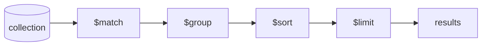

# MongoDB Aggregation

## What

The aggregation pipeline is MongoDB's query language for analytics and transformations: documents flow through stages, and each stage transforms the stream — filter, group, join, reshape, sort.

## Why It Matters

Anything beyond "find documents matching X" is aggregation: totals per month, top sellers, dashboards, reporting. Without it you either pull raw data into the app and reduce it in TypeScript (slow, memory-hungry) or add a second analytics database. The pipeline runs inside the database, close to the data, using indexes where possible.

## How It Works

Examples run against the sample dataset from [NoSQL vs Relational](01-nosql-vs-relational.md), freshly loaded. Paid orders are A (Ada, 899), B (Grace, 299), D (Alan, 948); order C (Ada, 597) is pending.

### Pipeline Mentality



Each stage takes documents in, emits documents out. Order matters: `$match` early shrinks the stream and lets indexes do their work.

### Revenue by Customer

```javascript
db.orders.aggregate([
  { $match: { status: "paid" } },              // 3 documents survive: A, B, D
  { $group: {
      _id: "$userId",
      orders: { $sum: 1 },
      revenue: { $sum: "$total" },
      avgOrder: { $avg: "$total" }
  }},
  { $sort: { revenue: -1 } },
  { $limit: 2 },
  { $project: { _id: 0, userId: "$_id", orders: 1, revenue: 1, avgOrder: 1 } }
])
```

Output:

```javascript
[
  { userId: 3, orders: 1, revenue: 948, avgOrder: 948 },   // Alan
  { userId: 1, orders: 1, revenue: 899, avgOrder: 899 }    // Ada — Grace (299) cut by $limit
]
```

Read the pipeline left to right: filter, collapse per user, rank, cut, reshape. Every analytics query you will write is a variation of this shape.

### Joining Collections: `$lookup` + `$unwind`

The document model avoids most joins, but cross-collection questions need `$lookup` — a left outer join. `as` always produces an array; `$unwind` flattens it back to one document per match:

```javascript
db.orders.aggregate([
  { $match: { status: "paid" } },
  { $group: { _id: "$userId", revenue: { $sum: "$total" } } },
  { $sort: { revenue: -1 } },
  { $lookup: {
      from: "users",
      localField: "_id",
      foreignField: "_id",
      as: "user"
  } },
  { $unwind: "$user" },
  { $project: { _id: 0, name: "$user.name", email: "$user.email", revenue: 1 } }
])
```

Output:

```javascript
[
  { name: "Alan Turing",  email: "alan@example.com",  revenue: 948 },
  { name: "Ada Lovelace", email: "ada@example.com",   revenue: 899 },
  { name: "Grace Hopper", email: "grace@example.com", revenue: 299 }
]
```

### Revenue by Product: `$unwind` + `$group`

Embedded arrays multiply documents — `$unwind` emits one document per array element, then `$group` aggregates per SKU:

```javascript
db.orders.aggregate([
  { $match: { status: "paid" } },
  { $unwind: "$items" },                       // 3 orders → 5 line documents
  { $group: {
      _id: "$items.sku",
      unitsSold: { $sum: "$items.qty" },
      revenue: { $sum: { $multiply: ["$items.qty", "$items.price"] } }
  } },
  { $sort: { revenue: -1 } },
  { $lookup: {
      from: "products",
      localField: "_id",
      foreignField: "sku",
      as: "product"
  } },
  { $unwind: "$product" },
  { $project: {
      _id: 0, sku: "$_id", name: "$product.name",
      unitsSold: 1, revenue: 1, leftInStock: "$product.stock"
  } }
])
```

Output:

```javascript
[
  { sku: "TS-01", name: "T-Shirt", unitsSold: 3, revenue: 1050, leftInStock: 120 },
  { sku: "CAP-3", name: "Cap",     unitsSold: 3, revenue: 897,  leftInStock: 45  },
  { sku: "MUG-9", name: "Mug",     unitsSold: 1, revenue: 199,  leftInStock: 80  }
]
```

### One Pass, Many Views: `$facet`

`$facet` runs sub-pipelines on the same input — a dashboard in one request:

```javascript
db.orders.aggregate([
  { $facet: {
      revenueByStatus: [
        { $group: { _id: "$status", revenue: { $sum: "$total" }, count: { $sum: 1 } } },
        { $sort: { revenue: -1 } }
      ],
      topOrder: [
        { $sort: { total: -1 } },
        { $limit: 1 },
        { $project: { userId: 1, total: 1 } }
      ],
      averageOrderValue: [
        { $group: { _id: null, aov: { $avg: "$total" } } }
      ]
  } }
])
```

Output:

```javascript
[{
  revenueByStatus: [
    { _id: "paid",    revenue: 2146, count: 3 },
    { _id: "pending", revenue: 597,  count: 1 }
  ],
  topOrder: [ { _id: "D", userId: 3, total: 948 } ],
  averageOrderValue: [ { _id: null, aov: 685.75 } ]
}]
```

### Pagination in Aggregations

`$skip` and `$limit` work in pipelines too — page 2 with 10 per page:

```javascript
db.orders.aggregate([
  { $sort: { createdAt: -1 } },
  { $skip: 10 },
  { $limit: 10 },
  { $project: { items: 0 } }
])
```

With the 4-document sample this returns nothing (skip exhausts the stream) — the pattern matters for real datasets.

## Common Mistakes

- **`$match` after `$group`.** Filtering first is the difference between an indexed scan and a full collection read.
- **Aggregating on a non-indexed field at scale.** Check with `explain("executionStats")` — `COLLSCAN` means add an index.
- **Pulling raw documents to reduce in app code.** If the server can compute it, let it.
- **One giant pipeline doing five jobs.** Split with `$facet` (parallel sub-pipelines in one pass) or intermediate materialization, and name the stages with comments.
- **Forgetting `$unwind` after `$lookup`.** The joined field is an array — grouping or projecting `"user.field"` without unwinding yields arrays inside arrays.
