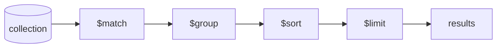

# MongoDB Aggregation

## What

The aggregation pipeline is MongoDB's query language for analytics and transformations: documents flow through stages, and each stage transforms the stream — filter, group, join, reshape, sort.

## Why It Matters

Anything beyond "find documents matching X" is aggregation: totals per month, top sellers, dashboards, reporting. Without it you either pull raw data into the app and reduce it in TypeScript (slow, memory-hungry) or add a second analytics database. The pipeline runs inside the database, close to the data, using indexes where possible.

## How It Works

### Pipeline Mentality



Each stage takes documents in, emits documents out. Order matters: `$match` early shrinks the stream and lets indexes do their work.

### The Stages You Will Actually Use

```javascript
db.orders.aggregate([
  // $match — filter (use indexes here)
  { $match: { status: "paid", createdAt: { $gte: ISODate("2026-01-01") } } },

  // $group — the GROUP BY
  { $group: {
      _id: "$userId",
      orderCount: { $sum: 1 },
      revenue: { $sum: "$total" },
      avgOrder: { $avg: "$total" }
  }},

  // $sort + $limit — top 10 by revenue
  { $sort: { revenue: -1 } },
  { $limit: 10 },

  // $project — shape the output
  { $project: { _id: 0, userId: "$_id", orderCount: 1, revenue: 1 } }
])
```

### Joining Collections: `$lookup`

The document model avoids most joins, but cross-collection questions need `$lookup` — a left outer join:

```javascript
db.orders.aggregate([
  { $group: { _id: "$userId", revenue: { $sum: "$total" } } },
  { $lookup: {
      from: "users",
      localField: "_id",
      foreignField: "_id",
      as: "user"
  } },
  { $unwind: "$user" },
  { $project: { email: "$user.email", revenue: 1 } }
])
```

`as` always produces an array — `$unwind` flattens it back to one document per match.

### Reshaping: `$unwind` and `$group` Together

Embedded arrays multiply documents — the classic "revenue by product" over orders with item arrays:

```javascript
db.orders.aggregate([
  { $unwind: "$items" },
  { $group: {
      _id: "$items.sku",
      unitsSold: { $sum: "$items.qty" },
      revenue: { $sum: { $multiply: ["$items.qty", "$items.price"] } }
  } },
  { $sort: { revenue: -1 } }
])
```

## Common Mistakes

- **`$match` after `$group`.** Filtering first is the difference between an indexed scan and a full collection read.
- **Aggregating on a non-indexed field at scale.** Check with `explain("executionStats")` — `COLLSCAN` means add an index.
- **Pulling raw documents to reduce in app code.** If the server can compute it, let it.
- **One giant pipeline doing five jobs.** Split with `$facet` (parallel sub-pipelines in one pass) or intermediate materialization, and name the stages with comments.
