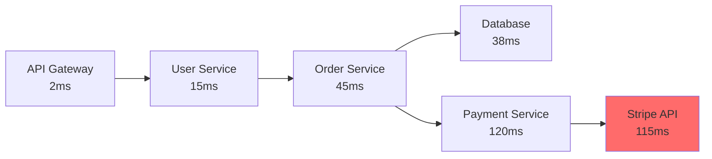
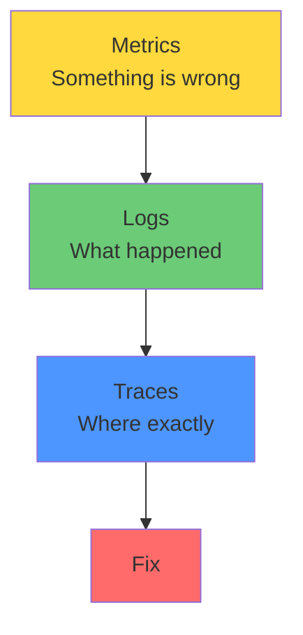

# Three Pillars of Observability

## What

Observability is the ability to understand the internal state of a system by examining its external outputs. It rests on three pillars: metrics, logs, and traces.

## Why It Matters

You cannot fix what you cannot see. When something goes wrong in production, these three signals are how you find the problem, understand the impact, and confirm the fix.

## The Three Pillars

### Metrics — Aggregate Numbers Over Time

Metrics answer: "How much? How fast? How often?"

Examples: requests per second, error rate, P99 latency, CPU usage, queue depth.

Metrics are cheap to store and fast to query. Use them for dashboards and alerts. They tell you something is wrong.

### Logs — Discrete Events With Context

Logs answer: "What happened? When? To whom?"

Examples: "User 42 placed order 1234 at 10:32:01", "Payment failed: connection timeout to Stripe API".

Logs are expensive to store and slow to search. Use them for debugging specific incidents. They tell you what went wrong.

### Traces — Request Journey Across Services

Traces answer: "Where did this request go? How long did each step take?"

A trace follows a single request across all services it touches.

Traces show you where time is spent and where failures occur in a distributed system. They tell you why it went wrong.

## When Each Helps

| Scenario                     | Best Signal |
|------------------------------|-------------|
| Is the service up?           | Metrics     |
| Is it getting slower?        | Metrics     |
| What caused this error?      | Logs        |
| What did this user do?       | Logs        |
| Where is the latency?        | Traces      |
| Which service is the bottleneck? | Traces  |
| How many 500s in the last hour? | Metrics  |
| Why did this specific request fail? | Logs + Traces |

## How They Connect

A typical investigation:
1. A metric alert fires (error rate above threshold)
2. You check logs around that time for the affected service
3. You find a trace ID in the logs and follow the request across services
4. You find the bottleneck or failure point

## The Key Link: Correlation

These three signals must connect. Every log line should have a trace ID. Every trace should link to relevant logs. Metrics should be labeled with service names.

Without correlation, you have three separate tools that don't help each other.

## Common Mistakes

- Collecting all three but not linking them. A trace ID in every log line is the minimum viable correlation.
- Starting with traces before you have metrics and logs. Metrics and logs are simpler. Add traces when you have multiple services.
- Over-instrumenting. Instrument the critical paths first (external API calls, database queries, message queue publishes).
