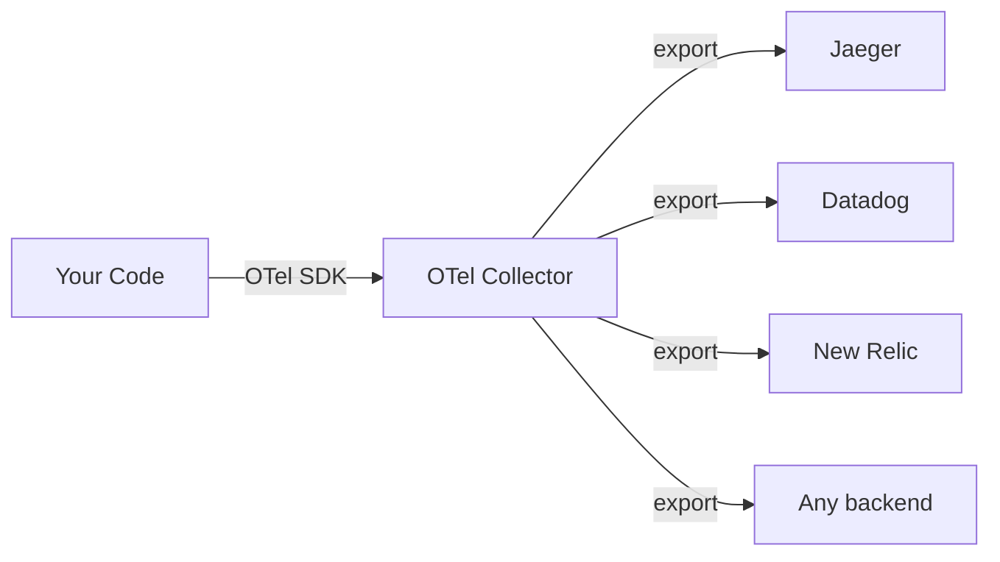

# Distributed Tracing

## What

Distributed tracing follows a single request as it travels across multiple services. It shows you the full path, timing, and failures.

## Why You Need It

In a monolith, a stack trace tells you what happened. In a distributed system, a request might hit 5 services. Each service has its own logs. Without tracing, you are piecing together a puzzle from separate log files, hoping you found the right request.

## Core Concepts

### Trace ID

A unique identifier for the entire request journey. Every service that handles the request logs the same trace ID.

```
trace_id: abc-123-def
```

### Span ID

A unique identifier for one operation within the trace. Each service creates a span.

```
trace_id: abc-123-def
span_id: span-001 (API Gateway received request)
span_id: span-002 (User Service fetched user)
span_id: span-003 (Order Service created order)
span_id: span-004 (Database query executed)
```

### Parent-Child Relationships

Spans form a tree. The API gateway span is the root. Each downstream call is a child.

```
[API Gateway: span-001, 2ms]
  └── [User Service: span-002, 15ms]
        └── [DB Query: span-005, 12ms]
  └── [Order Service: span-003, 45ms]
        └── [DB Query: span-004, 10ms]
        └── [Payment Service: span-006, 120ms]
              └── [Stripe API: span-007, 115ms]
```

### Context Propagation

The trace ID and current span ID must be passed from service to service. This is usually done via HTTP headers:

```
traceparent: 00-abc123def-parent-span-id-01
tracestate: custom=value
```

The W3C Trace Context standard defines the `traceparent` header format. Use it.

## OpenTelemetry

OpenTelemetry is the standard for generating, collecting, and exporting traces (and metrics and logs). It is vendor-neutral.



What you do:
1. Instrument your code with the OpenTelemetry SDK
2. Send data to the OpenTelemetry Collector
3. The Collector exports to your tracing backend (Jaeger, Zipkin, Datadog, etc.)

Manual instrumentation (every language):
```python
from opentelemetry import trace

tracer = trace.get_tracer("my-service")

def handle_request(request):
    with tracer.start_as_current_span("handle_request") as span:
        span.set_attribute("user_id", request.user_id)
        result = process_order(request)
        span.set_attribute("order_id", result.order_id)
        return result
```

Auto-instrumentation is available for most frameworks — it captures HTTP calls, database queries, and message queue operations without code changes.

## What to Look for in a Trace

- **Slow spans** — Where is the time going?
- **Error spans** — Which service failed?
- **Retries** — Is a service retrying calls? Why?
- **Fan-out** — Is one request triggering too many downstream calls?
- **Missing spans** — Gaps indicate uninstrumented code or dropped context.

## Common Mistakes

- Not propagating context. If service A calls service B but doesn't pass the trace headers, the trace is broken. Use auto-instrumentation to avoid this.
- Creating too many spans. One span per HTTP call is right. One span per line of code is wrong.
- Sampling too aggressively. If you only trace 1% of requests, you might miss the one that fails.
- Ignoring traces for successful requests. Traces are not just for debugging failures. They show you where latency hides.
