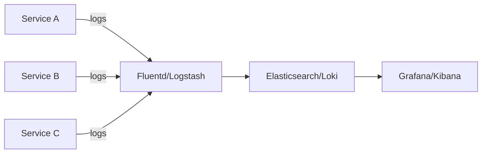

# Structured Logging

## What

Structured logging means your logs are machine-readable data (usually JSON), not free-form text. Each log entry has consistent fields.

## Why It Matters

When something breaks at 3 AM, you need to search and filter logs fast. Unstructured logs require reading line by line. Structured logs let you query: "show me all errors from the payment service in the last hour with user_id=42."

## Text vs Structured

Text log:
```
2024-01-15 10:32:01 ERROR Failed to process payment for user 42 - connection timeout
```

Structured log:
```json
{
  "timestamp": "2024-01-15T10:32:01.234Z",
  "level": "error",
  "service": "payment-service",
  "message": "Failed to process payment",
  "user_id": 42,
  "error_type": "connection_timeout",
  "request_id": "req-abc123",
  "duration_ms": 5003
}
```

The second one is searchable, filterable, and aggregatable.

## Log Levels

Use them consistently. They mean something specific.

| Level   | When to Use                                         |
|---------|-----------------------------------------------------|
| ERROR   | Something failed. Needs attention.                  |
| WARN    | Unexpected but recoverable. Deprecation. Rate limit approaching. |
| INFO    | Business events. User signed up. Order placed.      |
| DEBUG   | Diagnostic info for development. Detailed flow.     |
| TRACE   | Very fine-grained. Function entry/exit. Off in production. |

Rules:
- ERROR does not mean "any exception." It means "something a human should look at."
- INFO is not for "I am here" debug messages. It is for meaningful business events.
- DEBUG and TRACE should be off in production unless actively debugging.

## What to Log

- Request ID — correlating logs across services
- Timestamp — in UTC, ISO 8601 format
- Service name — identifying the source
- User ID or API key — who triggered it
- Duration — how long it took
- Status/result — success or failure
- Error details — type, message, stack trace (for errors only)

## What NOT to Log

- Passwords, even hashed
- API keys and access tokens
- Credit card numbers (PCI compliance)
- Social security numbers or government IDs
- Full request/response bodies in production
- Health check requests (they will flood your logs)

## Centralized Logging

In production, logs from multiple services go to a central place:



Common stacks:
- **ELK** — Elasticsearch, Logstash, Kibana
- **EFK** — Elasticsearch, Fluentd, Kibana
- **Loki + Grafana** — Lighter weight, indexes labels only

## Per-Language Example

```python
import structlog
logger = structlog.get_logger()
logger.info("order_placed", order_id=123, user_id=42, total=59.99)
```

```go
slog.Info("order_placed", "order_id", 123, "user_id", 42, "total", 59.99)
```

```java
log.info("order_placed").kv("order_id", 123).kv("user_id", 42).kv("total", 59.99).log();
```

## Common Mistakes

- Logging at INFO level for everything and never using DEBUG. You flood production logs with noise.
- Not including a request ID. Without it, you cannot trace a request across services.
- Logging entire request bodies. It leaks PII and bloats storage.
- Using different timestamp formats across services. Standardize on ISO 8601 UTC.
