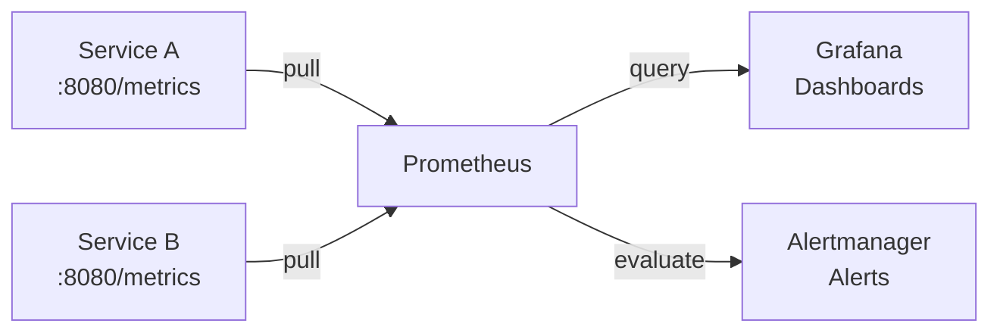

# Monitoring

## What

Monitoring is knowing how your system is behaving right now. It answers: is the system healthy? Are users having a good experience? Is something about to break?

## RED Method

For every service, track three things:

- **Rate** — How many requests per second?
- **Errors** — How many requests are failing?
- **Duration** — How long does each request take?

These three metrics tell you most of what you need. If rate spikes, you have a load problem. If errors spike, you have a correctness problem. If duration spikes, you have a performance problem.

## Prometheus Mental Model

Prometheus is a time-series database that pulls metrics from your services on a fixed interval (usually 15 seconds).



Your job: expose a `/metrics` endpoint. Prometheus does the rest.

Metrics format:
```
http_requests_total{method="GET", path="/api/users", status="200"} 1543
http_request_duration_seconds{method="GET", path="/api/users", quantile="0.99"} 0.142
```

Four metric types:
- **Counter** — Only goes up (total requests, total errors)
- **Gauge** — Goes up and down (current connections, queue depth)
- **Histogram** — Distribution of values (request duration)
- **Summary** — Pre-calculated quantiles (similar to histogram, calculated client-side)

## Grafana Dashboards

Grafana queries Prometheus and visualizes the data. A good dashboard:

- Has a clear title and purpose
- Shows the RED metrics at the top
- Uses consistent color coding (green = good, red = bad)
- Has links to related dashboards and logs
- Is useful during an incident, not just when everything is fine

## Alerting on Symptoms, Not Causes

Alert on user-facing problems, not internal metrics.

Bad alert: "CPU usage is above 80%"
Good alert: "P99 latency is above 2 seconds for 5 minutes"

Why: CPU might be high and everything is fine. Latency above 2 seconds means users are having a bad experience. Alert on the symptom, investigate the cause.

Alert tiers:
- **Page** — Wake someone up. Service is down, data is at risk.
- **Ticket** — Create a task. Something needs attention soon.
- **Log** — Record it. Useful for trends and post-mortems.

## Common Mistakes

- Alerting on everything. Alert fatigue is real. If you get 50 alerts a day, you ignore all of them.
- Building dashboards nobody reads. Dashboards are for incidents and reviews. If they don't serve a purpose, remove them.
- Tracking only infrastructure metrics (CPU, memory, disk). Track business metrics too: orders per minute, signup conversion rate.
- Not having a runbook for each alert. When the alert fires, the on-call person should know what to do.
