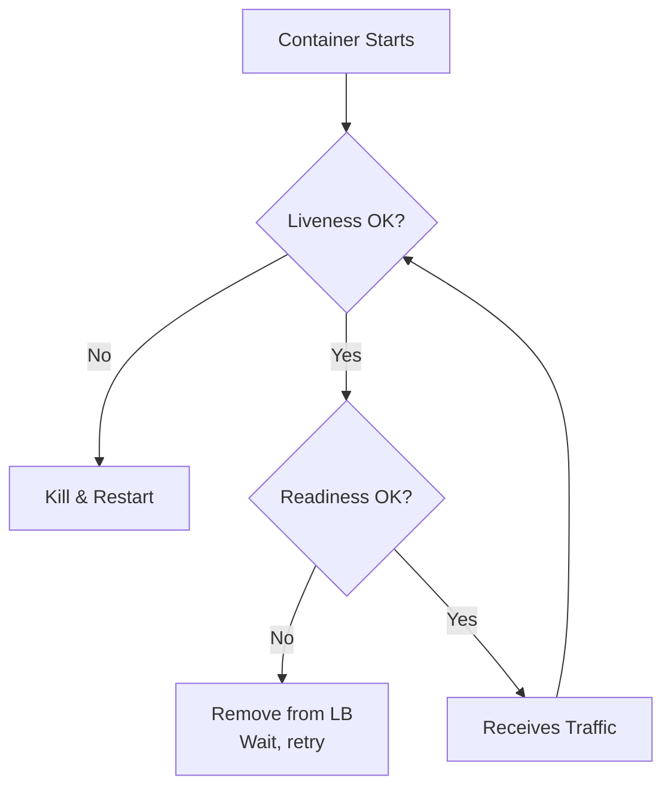

# Health Checks

## What

Health checks let the infrastructure know if your service is alive and ready to handle traffic. Without them, the orchestrator cannot tell the difference between "starting up," "working fine," and "dead."

## Two Types of Probes

### Liveness Probe — "Am I alive?"

Answers: is this process running and not deadlocked?

If the liveness probe fails, the orchestrator kills and restarts the container.

```python
@app.get("/healthz")
def liveness():
    return {"status": "ok"}
```

Keep it simple. Check that the process can respond to an HTTP request. That is it. Do not check database connections or downstream services here.

Why: if the process is in a deadlock or infinite loop, it cannot respond. The orchestrator restarts it.

### Readiness Probe — "Am I ready to serve traffic?"

Answers: can I handle requests right now?

If the readiness probe fails, the orchestrator removes the pod from the load balancer but does not restart it.

```python
@app.get("/ready")
def readiness():
    if not db.is_connected():
        return {"status": "not ready"}, 503
    if not cache.is_connected():
        return {"status": "not ready"}, 503
    return {"status": "ready"}
```

Check things the service needs to serve requests: database, cache, message queue connections.

Why: the service might be alive but unable to serve because the database is down. Traffic should go somewhere else.



## Startup Probe — "Have I started yet?"

Some services take a long time to initialize (loading ML models, warming caches). A startup probe gives them time before liveness checks begin.

If the startup probe succeeds, liveness and readiness probes take over.

## Graceful Shutdown

When the orchestrator wants to stop your service:

1. Send SIGTERM to the process
2. Stop accepting new requests
3. Finish in-flight requests
4. Close database connections
5. Exit

```python
import signal, sys

def handle_shutdown(signum, frame):
    stop_accepting_new_requests()
    wait_for_in_flight_requests(timeout=30)
    close_database_connections()
    sys.exit(0)

signal.signal(signal.SIGTERM, handle_shutdown)
```

Without graceful shutdown:
- In-flight requests get dropped (users see errors)
- Database connections leak
- Background tasks get killed mid-execution

## Circuit Breaker Integration

A circuit breaker stops calling a failing downstream service. It protects your service from cascading failures.

States:
- **Closed** — Normal. Requests go through.
- **Open** — Too many failures. Requests are rejected immediately. Give the downstream service time to recover.
- **Half-Open** — After a timeout, try one request. If it succeeds, close the circuit. If it fails, stay open.

Connect health checks to circuit breakers. If a downstream dependency is failing, your readiness probe can report "not ready" to stop incoming traffic until the dependency recovers.

## Common Mistakes

- Making the liveness probe check the database. If the database is slow, the liveness probe fails, the orchestrator restarts your service, and the reconnect storm makes things worse.
- Not setting timeouts on health checks. A health check that hangs forever is worse than one that fails.
- Ignoring graceful shutdown. The default SIGTERM handler just kills the process.
